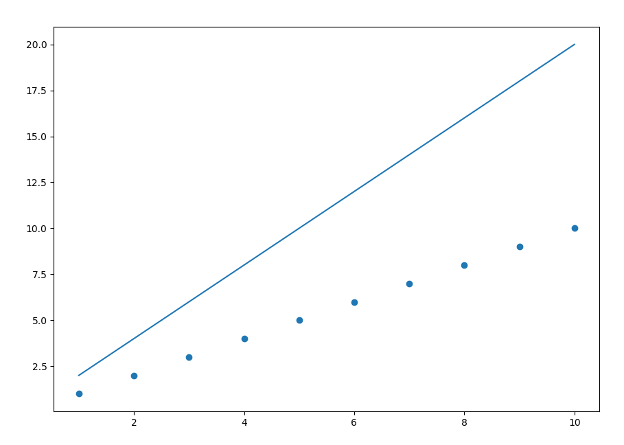

- [pandas](#pandas)
- [numpy](#numpy)
- [matplotlib](#matplotlib)


## pandas [[홈페이지]](<http://pandas.pydata.org/pandas-docs/stable/getting_started/overview.html#data-structures>)

### pandas란?

Pandas는 빠르고, 유연하며 풍부한 데이터 구조의 파이썬 패키지이다. 서로 관계있거나, 라벨링 된 데이터를 쉽고 직관적으로 사용할 수 있도록 도와준다.(고 홈페이지에 써있다.)

조금 더 쉽게 설명해보면, pandas는 <u>행과 열로 이루어진 데이터 오브젝트(=관계 or 라벨링)를 만들어 다루며, 데이터를 처리하는데 편리한 파이썬 라이브러리</u>이다.

### pandas를 왜 쓸까?

- 부동 소수점 데이터 뿐만 아니라, 누락된 데이터(NaN으로 처리)를 손쉽게 처리
- 크기 변경 : DataFrame 및 상위 차원 개체에서 **열을 삽입하고 삭제** 가능
- 데이터 정렬
- 다른 데이터 구조(python 및 numpy 등)의 비정형 데이터를 DataFrame 객체로 쉽게 변환 가능
- 직관적인 데이터 병합 및 결합
- csv file, excel file 등 여러 파일을 로드/저장 하기에 용이. => 원하는 데이터 형식으로 변환해준다.


### data 구조?

| 차수 | 이름      | 기술                     |
| ---- | --------- | ------------------------ |
| 1    | Series    | 1차원 배열               |
| 2    | DataFrame | 2차원 배열. (일반적으로) |


#### 1. Series

- pd.Series는 1차원 데이터를 다룰 때 사용. 변수를 출력해보면 인덱스 번호와 이름, 자료형도 함께 출력된다.

- **생성함수**

  - Series(data, name): data를 name 이라는 이름의 Series형태로 만들어 준다.

    ```python
    import pandas as pd
    
    ages = pd.Series([18, 21, 20, 16, 32, 22], name="ages")
    print(ages)
    ============
    0    18
    1    21
    2    20
    3    16
    4    32
    5    22
    Name: ages, dtype: int64
    ```

    ```python
    ages.index=['a', 'b', 'c', 'd', 'e', 'f']
    print(ages)
    =============
    a    18
    b    21
    c    20
    d    16
    e    32
    f    22
    Name: ages, dtype: int64
    
    ```

    ```python
    ages2 = pd.Series([18, 21, 20, 16, 32, 22],
                      index=['a', 'b', 'c', 'd', 'e', 'f'],
                      name="ages2")
    print(ages2)
    ==============
    a    18
    b    21
    c    20
    d    16
    e    32
    f    22
    Name: ages2, dtype: int64
    ```

    ```python
    class_name = {'국어' : 90,'영어' : 70,'수학' : 100,'과학' : 80}
    class_name = pd.Series(class_name)
    print(class_name,'\n')
    ============
    국어     90
    영어     70
    수학    100
    과학     80
    dtype: int64 
    ```

    

    

    - Series로 1차원 배열을 사용하여 만들면 자동으로 0번부터 순서가 붙게된다. 
      - 이 때 index를 따로 설정하고 싶으면 index라는 1차원 배열을 나중에 넣어주거나 생성시 사용하면 된다.
    - Series는 python dictionary로 만드는 것이 용이한데, index명으로 사용할 key값과 value값을 각각 입력하여 한번에 Series 처리하면 쉽게 사용할 수 있다.

#### 2. DataFrame

- DataFrame은 Series와 달리 여러개의 column을 가질 수 있다.
- DataFrame을 정의할 때는 2차원 리스트를 매개 변수로 전달하며 여러개의 Series 데이터를 합쳐 DataFrame을 만들 수도 있다.

##### **DataFrame ?**

```python
import pandas as pd

values = [[1, 2, 3], [4, 5, 6], [7, 8, 9]]
index = ['one', 'two', 'three']
columns = ['A', 'B', 'C']

df = pd.DataFrame(values, index=index, columns=columns)
print(df)
===========
       A  B  C
one    1  2  3
two    4  5  6
three  7  8  9
```

- DataFrame은 value값과 index, columns으로 이루어진다.

```python
print(df.index) # index 출력
===========
Index(['one', 'two', 'three'], dtype='object')

print(df.columns) # column명 출력
===========
Index(['A', 'B', 'C'], dtype='object')

print(df.values) # 값 출력
===========
[[1 2 3]
 [4 5 6]
 [7 8 9]]
```


##### **생성 함수**

- DataFrame(data): data를 DataFrame 구조로 만들어 준다.

  ```python
  import pandas as pd
  
  data = [['name', 'age'], ['A', 20], ['B', 29], ['c', 24], ['d', 26]]
  data = pd.DataFrame(data)
  
  print(data)
  ============
        0    1
  0  name  age
  1     A   20
  2     B   29
  3     c   24
  4     d   26
  ```

  - name, age가 들어가는 columns가 0번에 들어간다. 하지만 저 자리에 **꼭 columns가 들어가야 하는 것은 아니다.**
  - 먼저 나오는 것을 0번, 나중에 나오는 것을 1번으로 label이 붙는다. == index가 붙는다. 
  - 그러나, 위의 방법은 좋지 못한(0번에 column 명이 붙는) 방법이다.

- ```python
  data = [['A', 20], ['B', 29], ['c', 24], ['d', 26]]
  df = pd.DataFrame(data)
  print(df)
  ============
  	0   1
  0  A  20
  1  B  29
  2  c  24
  3  d  26
  ```

  - column 명을 제거 했을 경우, 0번 index부터 값이 시작할 수 있다.
  - 이 경우, column 명을 추가하는 방법은 아래와 같다.

- ```python
  df = pd.DataFrame(data, columns=['name', 'age'])
  print(df)
  ============
        name  age
  0    A   20
  1    B   29
  2    c   24
  3    d   26
  
  ```

  - 위의 data를 가지고 columns을 추가하여 새롭게 df를 만들고, 출력한다.

- python의 dictionary를 가지고 만드는 방법도 존재한다.

  ```python
  data = {'name': ['A', 'B', 'c', 'd'],
          'age': [20, 29, 24, 26]}
  df = pd.DataFrame(data)
  print(df)
  ===========
    name  age
  0    A   20
  1    B   29
  2    c   24
  3    d   26
  
  ```

  - dictionary의 key가 알아서 column 명이 된다.


##### 데이터 추출 및 추가 함수

- `loc()`: 명시적인 인덱스를 참조하는 인덱싱/슬라이싱
- `iloc()` : 정수 인덱스 인덱싱/슬라이싱. 단 iloc의 경우 리스트와 같이 마지막 인덱스는 포함되지 않는다.
- `loc`, `iloc` 함수에 Index 값을 입력하여 원하는 데이터 인덱스를 추출/ 추가할 수 있다.


##### 데이터 삭제 함수

- `drop()` : index, column 삭제
- `drop()`함수에 Index 값을 입력하여 원하는 데이터 인덱스를 삭제할 수 있다.


```python
import pandas as pd

a = pd.Series([20, 15, 30, 25, 35], name='age')
b = pd.Series([68.5, 60.3, 53.4, 74.1, 80.7], name='weight')
c = pd.Series([180, 165, 155, 178, 185], name='height')
human = pd.DataFrame([a, b, c])

print(human)
===========
            0      1      2      3      4
age      20.0   15.0   30.0   25.0   35.0
weight   68.5   60.3   53.4   74.1   80.7
height  180.0  165.0  155.0  178.0  185.0


# loc(), iloc() 함수를 이용하여 특정 행, 열 추출
print(human.loc['age'], '\n')
===========
0    20.0
1    15.0
2    30.0
3    25.0
4    35.0
Name: age, dtype: float64 
        
print(human.iloc[0], '\n')
===========
0    20.0
1    15.0
2    30.0
3    25.0
4    35.0
Name: age, dtype: float64 

# loc(), iloc() 함수를 이용하여 데이터의 특정 범위 추출
print(human.loc['weight': 'height'], '\n')
===========
            0      1      2      3      4
weight   68.5   60.3   53.4   74.1   80.7
height  180.0  165.0  155.0  178.0  185.0 


print(human.iloc[1:3], '\n')
===========
            0      1      2      3      4
weight   68.5   60.3   53.4   74.1   80.7
height  180.0  165.0  155.0  178.0  185.0 


sex = ['F', 'M', 'F', 'M', 'F']
# 새로운 데이터 추가하기
human.loc['sex'] = sex
print(human, '\n')
===========
           0     1     2     3     4
age       20    15    30    25    35
weight  68.5  60.3  53.4  74.1  80.7
height   180   165   155   178   185
sex        F     M     F     M     F 


# 원하는 행/열 데이터 삭제하기
tmp = human.drop(['height'])
print(tmp, '\n')
===========
           0     1     2     3     4
age       20    15    30    25    35
weight  68.5  60.3  53.4  74.1  80.7
sex        F     M     F     M     F 

```


##### plus

- 다음과 같은 함수도 사용할 수 있다.
  - `df.head(n)` - 앞 부분을 n개만 보기
  - `df.tail(n)` - 뒷 부분을 n개만 보기
  - `df['열이름']` - 해당되는 열을 확인


## numpy

### Numpy란?

- 넘파이(Numpy)는 파이썬 기반의 고성능의 수치 계산을 위한 라이브러리. 벡터 및 행렬 연산에 있어서 매우 편리한 기능을 제공한다.
- 계산의 기반이 되는 배열(array)을 간편하게 생성할 수 있는 여러 가지 함수들을 제공한다.
  - N차원의 배열 객체 사용 용이
  - 유용한 선형 대수, 푸리에 변환 및 난수 구현 가능.
- Numpy를 활용해 deep learning 을 용이하게 만든 scipy 패키지도 존재한다.


### Numpy를 왜 쓸까?

다양한 함수를 제공하기 때문에 사용하는 것이 맞다. 특히 **벡터 및 행렬 연산이 용이** 한 것이 가장 큰 장점이다.

그럼, 어느정도까지 간단하게 사용할 수 있을까?

기존 파이썬에서 **행렬끼리의 합**은 어떤 결과를 보여주었을까? **행렬끼리의 차**는?

```python
a = [1, 2, 3]
b = [1, 1, 1]

print(a + b)

```

out:

```python
[1, 2, 3, 1, 1, 1]

```

<br>

```python
print(a - b)

```

out:

```
Traceback (most recent call last):
  File ".../numpy_test.py", line 4, in <module>
    print(a - b)
TypeError: unsupported operand type(s) for -: 'list' and 'list'

```

위에서 볼 수 있듯, python에서 list의 합은 list를 붙이는 것에서 끝나고, list의 차는 에러를 리턴한다.

<br>

그럼, numpy는 어떨까?

```python
import numpy as np
a = np.array([1, 2, 3])
b = np.array([1, 1, 1])

print("a + b : ", a + b)
print("a - b : ", a - b)

```

out:

```python
a + b :  [2 3 4]
a - b :  [0 1 2]

```

list 자체를 한번에 연산해준다. 단적으로 말하면, **행렬간의 쉬운 연산이 numpy 사용의 전부** 라고 생각해도 될 만큼 혁신적인 계산이다.

데이터 분석에 있어서, 우리가 가지고 있는 데이터에 맞는 모델을 구하려면 때때로 많은 방정식을 풀어야 한다. numpy는 그 방정식을 쉽게 풀 수 있는 아주 용이한 패키지이다.


### 용이한 함수

다양한 함수들이 존재하나, 이번 포스트에서는 인공지능 학습에서 자주 사용하고 활용도가 높은 함수 위주로 소개하려고 한다.

<hr>

#### list의 정보와 관련된 함수들

- np.array() : 직접 값을 넣어준 array로 list를 생성한다.
- np.ndarray() : n차원의 크기를 지정. 난수의 값을 가지는 list를 생성한다.
  - np.array()와 np.ndarray()로 만들어진 numpy 배열은 동일하다.
- np.ones(), np.zeros() : 1, 0으로만 이루어진 배열을 생성한다.
- array.shape : 배열의 크기
- array.ndim : 배열의 차원
- array.dtype : 배열의 type


```python
import numpy as np
a = np.array([[1, 2, 3]])
print(a)
	=> [[1 2 3]]
print(np.ndarray((1, 3)))
	=> [[1.71457464e+214 9.30277090e+242 4.56535246e-085]]
print(np.ones((1, 3)))
	=> [[1. 1. 1.]]
print(np.zeros((1, 3)))
	=> [[0. 0. 0.]]
print(a.dtype)
	=> int32
print(a.shape)
	=> (1, 3)

```


<hr>

#### list의 통계적 정보를 나타내는 함수들

- np.min(x) : 배열 x의 최솟값
- np.max(x) : 배열 x의 최댓값
- np.mean(x)  : 배열 x의 평균값
- np.median(x) : 배열 x의 중앙값
- np.var(x) : 배열 x의 분산
- np.std(x) : 배열 x의 표준편차

```python
a = np.array([[1, 2, 3], [4, 5, 6], [7, 8, 9]])
print(np.min(a))
	=> 1
print(np.max(a))
	=> 9
print(np.mean(a))
	=> 5.0
print(np.median(a))
	=> 5.0
print(np.var(a))
	=> 6.666666666666667
print(np.std(a))
	=> 2.581988897471611

```


## matplotlib [[홈페이지]](<https://matplotlib.org/>)

### Matplotlib란?

쉽게 말하면, python에서 그래프 표시를 가능하게 하는 라이브러리이다.

간단하게 2차원 선부터, 그림(이미지), 히스토그램, 분포도를 포함, 3차원 분포의 그래프를 그릴 수 있다.


### Matplotlib를 왜 쓸까?

기본적인 y = ax + b라는 라인을 그리는 것 부터, 수치화 된 데이터들을 시각화 하기 좋기 때문이다. 이후에 다룰 선형 회귀에서는 흩뿌려진 데이터들에 대해 선형회귀한 하나의 함수를 만들 때 시각적으로 표현해 직관적으로 원하는 값에 가까워지는 것을 알 수 있다.


### 다뤄보기

```python
import numpy as np
from matplotlib import pyplot as plt

x = np.array([1, 2, 3, 4, 5, 6, 7, 8, 9, 10])
y = np.array([1, 2, 3, 4, 5, 6, 7, 8, 9, 10])

plt.scatter(x, y)
plt.plot(x, 2 * x)
plt.show()

```

x에 따라 y 값에 해당 하는 부분에 점을 찍고, 2x에 해당하는 y에 선을 그리는 코드이다.




<br><br><br><br>


### 결론

여기까지 데이터 처리 패키지의 삼대장을 알아보았다.

세 가지의 패키지에 scipy와 같은 패키지를 더한다면 머신러닝을 공부하는데 큰 도움이 될 것이라고 생각한다.


### Ref

[딥 러닝을 이용한 자연어 처리 입문](<https://wikidocs.net/32829>)

[엘리스 - 파이썬으로 시작하는 데이터 분석](<https://doorbw.tistory.com/171>)