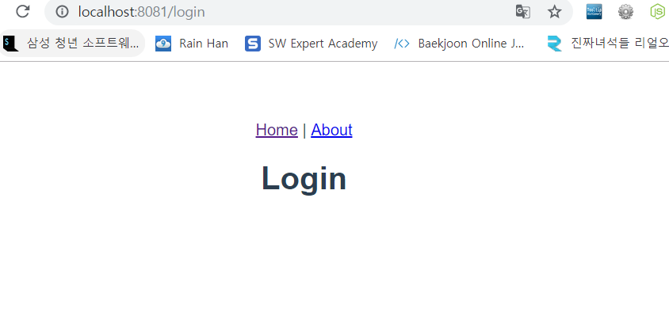
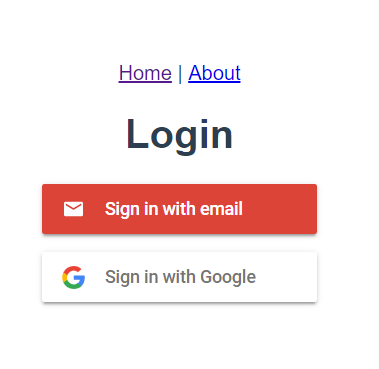

> 이 포스트에서는 firebaseui를 이용한 로그인 환경 구축을 목표로 한다.

[**firebaseui-web**](<https://github.com/firebase/firebaseui-web>) 관련 문서를 기반으로 한다.


# firebase ?

파이어베이스(firebase)는 구글에서 제공하고 있는 모바일 및 웹 애플리케이션 개발 플랫폼이다. 

웹에서 사용할 DB를 저장해 줄 수 있으며, 사진과 같은 자료를 storage에 저장 가능하다. 또한 로그인 계정을 Authentication에서 관리 가능하며, google, facebook, github와 같은 다양한 플랫폼과 로그인 계정을 연동하여 사용이 가능하다.

웹 서비스의 호스팅을 firebase를 통해 할 수 있으며, <del>유료 버전이긴 하지만</del> ML Kit 이름의 머신러닝 kit도 제공하고 있다.

DB는 json 형식으로 제공하며, 상당히 편한 방식으로 현재 사용자에 대한 정보를 알아 낼 수 있어 사용에 용이하다. 

단점으로는, firebase가 제공하는것이 다양하나, 개발자의 custom이 어렵다. authentication에서 제공하는 범위를 넘어가는 정보를 user에게 포함시키고 싶다면 따로 user db를 생성해서 user를 관리하는 방식으로 관리를 해야만 한다.


# firebaseui-web ?

firebaseui-web은 firebase와 다른 플랫폼간의 로그인 및 회원가입을 용이하게 해준다. ui가 예쁘게 제공되어 있어 사용하기만 하면 쉽게 사용이 가능하다.


로그인 페이지를 구현하기 이전에, 기본 사용할 페이지는 vue를 사용한다. 만약 vue 페이지가 없다면 [Vue router, Vuex, vuetify 사용하기](<https://sweetlog.netlify.com/Vue/using-vue-with-vuex-vue-router-vuetify/>) 를 참고하여 페이지를 구현한다. (vuetify는 사용하지 않는다.)


## firebase 콘솔 생성

[firebase console](<https://console.firebase.google.com/>) 사이트에 접속. 새로운 프로젝트를 생성하는것이 가장 먼저 해야하는 일이다.

프로젝트 추가 버튼을 누르고 나오는 작성란을 다음과 같이 채운다.


로딩이 끝나면 시작하기를 눌러 새롭게 시작하면 된다.


좌측 개발 탭에서 Authentication 탭을 선택하면 아직 사용자가 로그인 한 적이 없기 때문에 다음과 같이 사용자가 존재하지 않는다.


위 사진에서 빨간색으로 밑줄친 로그인 방법에 들어간 후 이메일/비밀번호를 클릭한다.


위와 같이 사용설정을 한 후 저장한다. 그렇게 되면 상태가 사용 설정됨으로 변경된다. 이렇게 되면 기본적으로 이메일/비밀번호로 로그인이 가능하게 된다.


## login router 생성

1. 로그인을 할 view 페이지인 `Loginl.vue` 파일을 `views`폴더 아래에 생성한다.

   `src/views/Login.vue`

   ```vue
   <template>
     <v-container>
       <h1>Login</h1>
     </v-container>
   </template>
   
   <script>
   export default {
   
   }
   </script>
   
   <style>
   
   </style>
   
   ```

2. 주소 설정을 위해 `router.js`에 Login 주소를 추가한다.

   `src/router.js`

   ```js
   import Home from './views/Home.vue'
   import Login from './views/Login.vue'
   ...
   routes: [
       ...
       {
         path: '/login',
         name: 'login',
         component: Login
       }
     ]
   ```

   로그인을 위한 Login을 import 하여 component로 사용한다.

   

   이렇게 지정을 해주게 되면 /login 페이지로 접속했을 경우 login 페이지가 열리게 된다.


## firebaseui 기본 사용 설정

1. firebase와 firebaseui를 npm으로 설치한다.

   > firebaseui를 사용하기 위해서는 cdn으로 불러오거나, npm으로 설치하는 방법이 존재한다. CDN으로 불러와서 구현하는 것은 다른 페이지에서 많이 보이고 있으나, vue에서 npm 설치하는 자료가 부족한 것 같아 이 포스트에서는 npm 설치로 진행한다.

   ```bash
   $ npm install firebase --save
   $ npm install firebaseui --save
   ```

   사용하고 있는 터미널에 두 명령어를 사용하여 firebase와 firebaseui를 설치한다.

2. firebaseui가 제공하고 있는 js와 css 파일을 import 한다.

   `main.js`

   ```js
   import store from './store'
   
   // firebaseui css
   require('../node_modules/firebaseui/dist/firebaseui.js')
   require('../node_modules/firebaseui/dist/firebaseui.css')
   
   ```

   들어가야 하는 위치는 크게 중요하지 않으나 들어가야 하는 파일은 중요하다.

   Vue router에서는 css 및 js의 import 위치를 router로 받아 url로 접속시켜버린다. 때문에 `index.html`의 head 안에 넣는다면 제대로 import 되지 않는다.

3. 위에서 만든 `login.vue`에 우리가 사용할 firebase의 기본 설정을 해줘야한다.

   `views/Login.vue`

   ```js
   <script>
   import * as firebaseui from 'firebaseui'
   import * as firebase from "firebase/app"
   
   const config = {
     apiKey: "<api-key>",
     authDomain: "<project-id>.firebaseapp.com",
     databaseURL: "https://<project-id>.firebaseio.com",
     projectId: "<project-id>",
   };
   firebase.initializeApp(config);
   const auth = firebase.auth();
   const ui = new firebaseui.auth.AuthUI(auth);
   
   export default {
   
   }
   </script>
   ```

   firebase에 접근해서 사용하기 위해서는 firebase에서 제공한 apiKey와 도메인, db url등과 같은 다양한 정보를 입력해야한다.

   다양한 정보를 넘겨 요청을 보낼 수 있지만 여기에서는 config 에 선언된 정보들만 보낼것이다. <> 표시 안에 있는 내용들을 채우면 되고, 이 내용은 firebase의 설정에서 찾을 수 있다.

   

   좌측 상단의 톱니바퀴를 누른 후 프로젝트 설정에 들어가면 다음과 같은 페이지가 나온다. 여기의 프로젝트 ID와 웹 API키를 위의 코드에 잘 넣어준다.


## email 로그인

`Login.vue`

```vue
<template>
  <v-container>
    <h1>Login</h1>
    <div id="firebaseui-auth-container"></div>
  </v-container>
</template>

<script>
...

export default {
  methods: {
    initUI: function() {
      // template에 존재하는 div에 ui.start 명령어를 사용하면 firebaseui가 알아서 그려준다.
      ui.start("#firebaseui-auth-container", {
        // 현재 사용하는 옵션은 이메일 로그인만 사용한다.
        signInoptions: [firebase.auth.EmailAuthProvider.PROVIDER_ID],
        callbacks: {
          // 로그인이 성공하면,
          signInSuccessWithAuthResult: (authResult, redirectUrl) => {
            // 로그인 정보를 각각의 data에 저장한다.
            alert(`${authResult.user.displayName}login 성공!`);
            return false;
          }
        }
      });
      
    }
    
  },
  mounted: function() {
    // 현재 로그인한 회원의 정보를 알 수 있는 함수이다. 존재하면 딕셔너리가, 아니면 null값이 나온다.
    auth.onAuthStateChanged((user) =>{
        if (user) {
          alert("이미 로그인 한 사용자입니다!");
        }
        //현재 유저가 존재하지 않으면 로그인창을 보여준다.
        this.initUI()
    })
  }
}
</script>


```

로그인 아래에 id가 `firebaseui-auth-container`인 div 태그를 만든다.

페이지가 렌더링 될 때 mounted에서는 현재 로그인 한 사용자가 있는지 아닌지를 파악한다.  만약 로그인 한 사용자가 없을 경우에는 로그인 창을 렌더링 한다.


이메일을 입력 후 이름과 비밀번호를 입력하면 자동으로 회원가입이 된다.

firebase의 authnetication에 접속하면 가입한 사람을 볼 수 있다.


## google login

구글 로그인은 페이스북 로그인에 비해 비교적 간단한 편이다. firebase에서만 구현이 가능하다.


이메일에서 했던것과 같이 로그인 방법에서 구글 로그인의 사용 설정을 열어준 후, 웹 SDK 구성의 웹 클라이언트 ID를 복사해둔다.

이후 `Login.vue`의 signInOptions를 수정한다.

```js
signInoptions: [
          firebase.auth.EmailAuthProvider.PROVIDER_ID,
            {
              provider: firebase.auth.GoogleAuthProvider.PROVIDER_ID,
              authMethod: "https://accounts.google.com",
              clientId:
                "클라이언트 아이디"
            },
          ],
```

위에서 복사해 둔 클라이언트 ID를 넣어준다.




 


### Ref

[firebaseui-web](<https://github.com/firebase/firebaseui-web>) 

