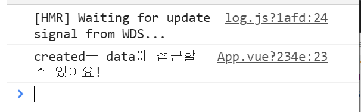
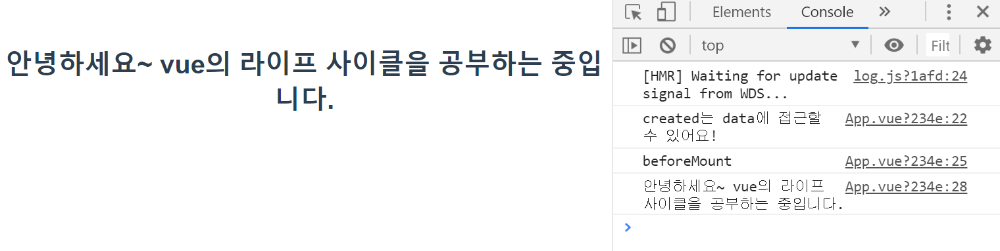
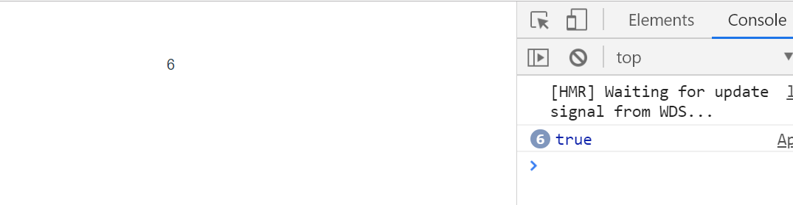

> 각 Vue의 인스턴스는 생성될 때 일련의 초기화 단계를 거치게 된다. 이 단계를 나타내는 vue.js의 라이프사이클과, 이 단계마다 실행될 수 있는 함수와 같은 라이프사이클 훅에 대해 알아본다.


## Lifecycle과 Lifecycle Hooks

우선, 라이프사이클은 무엇일까?<br>**라이프사이클(lifecycle)**은 인스턴스가 생성될 때 거치는 초기화 단계(데이터 관찰 설정, 템플릿을 컴파일, 인스턴스를 DOM에 마운트, 데이터 변경 시 DOM 업데이트) . 또는 호출 할 수 있는 속성들을 의미한다. <br>Vue.js 의 라이프사이클은 크게 Creation, Mounting, Updating, Destruction으로 나눌 수 있다.

그럼 라이프사이클 훅은 무엇일까?<br>**라이프사이클 훅(lifecycle hook)**은 사용자가 특정 단계(초기화 단계)에서 자신의 코드를 추가할 수 있는 함수처럼 생각할 수 있다. <del>(실제로 공식문서에서도 type이 function이다)</del> <br>라이프사이클 훅에는 beforeCreate, created, beforeMount, mounted, beforeUpdate, updated, beforeDestroy, destroyed 등이 존재한다. (공식문서를 보면 activated나 deactivated, erroCaptured도 사용 가능 한 것으로 보인다.)


[공식문서](https://kr.vuejs.org/v2/guide/instance.html#%EB%9D%BC%EC%9D%B4%ED%94%84%EC%82%AC%EC%9D%B4%ED%81%B4-%EB%8B%A4%EC%9D%B4%EC%96%B4%EA%B7%B8%EB%9E%A8)에서 제공하는 라이프사이클 다이어그램이 상당히 이해하기 쉽게 되어있어 참고하기 좋다.


Vue 인스턴스는 크게 생성(create), 부착(mount), 업데이트(update), 제거(destroy)의 4가지 과정(**라이프사이클**)을 거치게 된다. 이 과정에서 특정 기능을 수행할 수 있게 Vue에서는 라이프사이클 훅(hook)을 제공한다.


## creation (Initialization)

**컴포넌트가 시행될 때 가장 첫번째로 발생하는 과정**이다. 이 과정은 컴포넌트가 DOM에 올라가기 전에 수행된다. 다른 사이클들과는 다르게 creation은 **서버사이드 렌더링(server-side rendering : 서버측에서 렌더링)이 되는 동안에 수행**된다. 때문에 서버사이드 렌더링과 클라이언트 렌더링(client rendering) 모두에서 사용하기를 원하면 creation에서 사용하면 된다. 

이 과정에서 DOM이나 mounting element(this.$el)에는 접근할 수 없다. <br>=>컴포넌트가 DOM에 추가 되기 전이기 때문에 `this.$el`에 접근할 수 없다.


### beforeCreate

인스턴스가 초기화 된 직후에 발생한다. **데이터 관찰 및 이벤트, watcher 설정 전**에 호출된다.<br>=>data, event, watcher 설정 전에 호출되기 때문에 `data, methods`에 접근할 수 없다.

```js
<script>
export default {
  beforeCreate(){
    console.log("가장 먼저 실행됩니다~")
  }
}
</script>
```


### created

인스턴스가 생성된 후에 동기적으로 발생한다. 데이터 처리, computed, methods, watcher, event 등의 옵션 처리를 완료했다. 그러나 `mounted`가 시작되지 않았으므로 `$el` 속성을 사용하지 못한다. 템플릿과 가상 DOM에 아직 mounted 또는 렌더링 되지 않았다.


```js
<script>
export default {
  name: 'app',
  components: {
    HelloWorld
  },
  data() {
    return {
      msg: 'created는 data에 접근할 수 있어요!'
    }
  },

  created() {
    console.log(this.msg);
  }
}
</script>
```




## Mounting (DOM Insertion)

mounting 클래스를 사용하면 **첫 번째 렌더링 전 / 후에 컴포넌트에 즉시 접근할 수 있다**. 그러나 **서버 사이드 렌더링 중에는 실행되지 않는다**.<br>=> 초기 렌더링 직전 또는 직후, 구성 요소의 DOM에 접근하거나 수정해야할 때 사용한다.


### beforeMount

mounting이 시작되기 전에 호출된다.

초기 렌더링이 발생하기 전 / 템플릿 또는 렌더함수가 컴파일 된 후에 실행된다. 대부분의 경우 잘 사용하지 않는다. 

가상 DOM이 생성되어있으나, 실제 DOM에는 mount 되지 않은 상태이다.

```js
<script>
export default {
  beforeMount(){
    console.log('beforeMount');
  }
}
</script>
```


### mounted

일반적으로 가장 많이 사용한다. 인스턴스가 마운트된 후 `el`이 호출되며, 새로 작성된 인스턴스`vm.$el`로 대체된다. 루트 인스턴스가 문서 내 컴포넌트에 마운트 되어있으면 `vm.$el`이 호출될 때 문서에 포함된다. 또한 가상 DOM의 내용이 실제 DOM에 부착되고 난 이후에 실행되므로 `data`, `computed`, `methods`, `watch`등 모든 요소에 접근이 가능하다.

```html
<template>
  <div id="app">
    <h1>안녕하세요~ vue의 라이프 사이클을 공부하는 중입니다.</h1>
  </div>
</template>
```

```js
<script>
import HelloWorld from './components/HelloWorld.vue'

export default {
  ...
  mounted(){
    console.log(this.$el.textContent);
  }
}
</script>
```




현재 컴포넌트가 mount 되었다고 해서 모든 하위 구성요소도 mount 된 것을 보장하지 않는다. 


만약 전체의 뷰가 렌더되는 동안에 기다리기를 바란다면 `vm.$nextTick`을 mounted 안에 사용할 수 있다.

```js
mounted: function () {
  this.$nextTick(function () {
    // Code that will run only after the
    // entire view has been rendered
  })
}
```


## Updating (Diff & Re-render)

업데이트는 **컴포넌트의 변화 또는 re-render되는 발생 원인에 대해 민감하게 반응, 수행**된다. 이를 통해 `watch-compute-render` 사이클에 연결할 수 있다.

주로 디버깅이나 프로파일링을 위해 컴포넌트들이 언제 다시 렌더링 될 지 알고 있을 때 사용한다.

단순히 컴포넌트가 변화할 때 반응하기 위해 사용할 것이면 `computed` 또는 `watchers`를 사용하는것이 낫다.


### beforeUpdate

DOM이 패치(patch)되기 전, 데이터가 변경될 때 호출된다. 업데이트 전에 기존 DOM에 엑세스 할 수 있다.(수동으로 추가한 이벤트 리스너 제거 등이 용이하다.)

**초기 렌더링 서버 측에서만 수행되기 때문에 서버 사이드 렌더링 중에 호출되지 않는다.**


### updated

데이터 변경 후 호출되어 가상 DOM이 다시 렌더링 되고 patch될 때 호출된다. 이 경우 구성요소의 DOM이 업데이트 되므로 이 때 DOM에 종속된 동작을 수행할 수 있다. 그러나 대부분의 경우 이 부분에서 설정하지 말고 **`computed` 또는 `watcher`를 사용하는 것이 좋다**.

```html
<template>
  <div id="app">
    <p ref="dom-element">{{counter}}</p>
  </div>
</template>
```

```js
<script>
export default {
  data() {
    return {
      counter: 0
    }
  },
  updated() {
    // Fired every second, should always be true
    console.log(+this.$refs['dom-element'].textContent === this.counter)
  },

  created() {
    setInterval(() => {
      this.counter++
    }, 1000)
  }
}
</script>
```



1초에 1씩 증가하며 true를 찍는다.


updated 또한 mounted처럼 **모든 하위 구성요소의 렌더링을 보장하지 않는다**. 전체 뷰가 렌더링 될 때 까지 대기하려면 `vm.$nextTick`을 `updated` 내에서 사용하면 된다.

```js
updated: function () {
  this.$nextTick(function () {
    // Code that will run only after the
    // entire view has been re-rendered
  })
}
```


## Destruction (Teardown)

destruction은 cleanup 또는 analytics sending과 같이, 컴포넌트가 파괴될 때 수행된다. 컴포넌트가 해체되어 DOM에서 제거되면 실행된다.


### beforeDestroy

Vue 인스턴스가 삭제되기 전에 호출된다. 이 단계에서 인스턴스는 여전히 작동한다.

```js
<script>
export default {
  beforeDestroy() {
    console.log("삭제 하기 전!");
  }
}
</script>
```

이 경우에는 콘솔에 아무것도 찍히지 않는다. 따로 삭제하는 부분이 존재하지 않기 때문이다.


### destroyed

Vue 인스턴스가 제거된 후에 호출된다. 호출 될 경우, Vue 인스턴스의 모든 지시문이 바인딩 해제되고, 모든 이벤트 리스너가 제거되며, 모든 하위 Vue 인스턴스도 삭제된다.

```js
<script>
export default {
  destroyed() {
    console.log("삭제를 해보자");
  }
}
</script>
```

이 경우에도 마찬가지로 실제로 삭제가 된 부분이 없기 때문에 console에는 아무것도 찍히지 않을 것이다.


> Vue의 다양한 lifecycle hooks를 알고 잘 사용할 수 있다면 훨씬 다양한 방식의 페이지 구현이 가능할 것이다.


### Ref

[Vue.js 공식문서 - Vue 인스턴스](https://kr.vuejs.org/v2/guide/instance.html#%EC%9D%B8%EC%8A%A4%ED%84%B4%EC%8A%A4-%EB%9D%BC%EC%9D%B4%ED%94%84%EC%82%AC%EC%9D%B4%ED%81%B4-%ED%9B%85)

[재그지그](<https://wormwlrm.github.io/2018/12/29/Understanding-Vue-Lifecycle-hooks.html>)

[alligator.io](<https://alligator.io/vuejs/component-lifecycle/>)

[Vue Parent and Child lifecycle hooks](<https://medium.com/@brockreece/vue-parent-and-child-lifecycle-hooks-5d6236bd561f>)