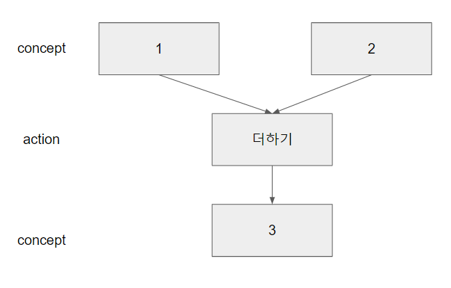

> 빅스비 캡슐 챌린지에 나가기로 했다. 조금 늦은감이 있지만 다음번에 잊어버리지 않으려고 작성해본다.
>
> 추가적으로, 빅스비 문서는 지금도 실시간(까진 아니지만...)급으로 내용이 수정되고 있다. [Bixby Developer Center](<https://bixbydevelopers.com/>)의 내용을 주기적으로 확인하는것이 좋다.


+ [빅스비 캡슐 구조](#Bixby Capsule 구조)
  + [모델링](#모델링)
  + [비즈니스 로직](#비즈니스 로직)
  + [Training](#Training)
  + [UX/UI](#UX/UI)


## Bixby Capsule 구조

빅스비 캡슐 구조는 크게 `모델링`, `비즈니스로직`, `UX, UI`, `트레이닝` 으로 나뉘어져 있다.


### 모델링

크게 컨셉(concept)과 액션(action)으로 나뉜다.

+ **Concept**

  + input, output과 같은 변수

  + 크게 두 종류 -  `Primitive`한 자료형과 `Structure`한 구조체로 나뉜다.

  + Primitive

    + 단순 자료형
    + ex) Text, Name, Enum 등

    ```bxb
    // StoreName.model.bxb
    text (StoreName) {
      description (가게 이름)
    }
    ```

    ```bxb
    // StoreTel.model.bxb
    text (StoreTel) {
      description (가게 전화번호)
    }
    ```

    

  + Struct

    + C의 구조체와 비슷한 형태.
    + Concept을 type으로 갖는다.

    ```bxb
    // StoreList.model.bxb
    structure (StoreInfo) {
      description (가게 정보)
      property (name) {			// property(다른곳에서 사용할 변수명)을
      							// name으로 사용한다.
        type (StoreName)		// StoreName concept을 사용한다.
        min (Required) max (One)// 꼭 필요하며, 최대 1개가 들어간다.
      }
      property (tel) {			// property를 name으로 사용한다.
        type (StoreTel)			// StoreTel concept을 사용한다.
        min (Optional) max (One)
      }
    }
    ```

  

+ **action**

  + 캡슐이 사용자가 원하는 작업을 이해하도록 하는 model
  + input을 가지고 output을 만드는 수행

  ```bxb
  // GetStoreTel.model.bxb
  action (GetStoreTel) {
    description( 전화번호를 가져온다. )
    type(Search)
    
    collect {
      input (storeName) {
        type (StoreName)
        min(Required) max (One)
      }
    }
    output (StoreInfo)
  }
  ```

  

+ 


### 비즈니스 로직

+ 실 동작코드(js파일)

  + 기본적으로 code 폴더 안에서 움직인다.

+ 모델링한 concept, action을 통해서 작업을 수행

  + 추가적으로 code와 action이 연결되었다고 알려주는 `endpoint` 파일이 존재한다.

+ 서비스 API 연동 == 외부 서버 연결 가능

  ```bxb
  // getStoreTel.js
  module.exports.function = function getStoreTel (storeName) {
    
    if (storeName == "A가게") {
    	return "02-xxxx-xxxx"
    }
    return "전화번호 정보가 없습니다."
  }
  
  ```

  ```bxb
  // endpoints.bxb
  endpoints {
    action-endpoints {
      action-endpoint (GetStoreTel){			// action명
        accepted-inputs (storeName)			// 매개변수명
        local-endpoint ("selectHospital.js")	// code 명
      }
    }
  }
  
  ```


### Training

+ 자연어 학습부분
+ 영어 및 한국어 학습
+ 발화 입력 -> concept 매칭 -> 태깅
+ 비교적 소수의 학습정보로도 학습이 가능하다
  + 따라서 다양한 패턴을 활용하는것이 더 좋다.


###  UX/UI

+ **Bixby Views**
  + 최종 결과를 사용자에게 보여주는 레이아웃작업
  + 대화 과정 중 답변을 최적화해서 출력한다.
  + match : 데이터 concept
  + message : 이 캡슐에서 제공할 말
    + dialog 연동
  + render : 그래픽 차원에서 어떻게 구현할것인가?
    + layout 연결
+ **Dialog**
  + 사용자에게 되묻거나 결과를 응답해주는 응답문을 생성


