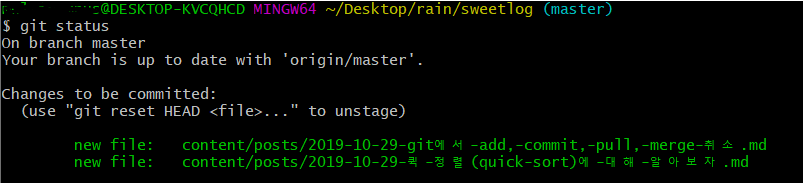
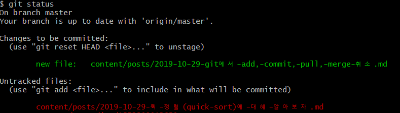
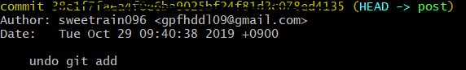

> 때때로 필요하지만 자주 사용하지 않아 잊어버리는 add, commit, pull merge 취소 명령어를 알아본다.


1. [git add 취소](#git-add-취소)
2. [git commit 취소](#git-commit-취소)


## Git의 reset 명령어

git을 다루다보면 add, commit 등의 명령어 취소를 자주 사용하게 된다. <del>add . 하고 안올릴것만 reset하면 얼마나 편하게여...?</del>

이 외에도 로컬 branch를 삭제했어야 하는데 그냥 이동한 후 pull을 받다가 충돌나는 등 다양한 문제가 발생할 수 있는데, 이 때 pull이나 merge 취소의 명령어를 필요로 하게된다.

때문에 이 글은, 지금 찾아보고 언젠가 잊어버릴까봐 작성하는 글이다.

<br>

<br>

### git add 취소



다음과 같이 `add .` 을 하게 되면 자주 목격하는 상황이다. 이 경우에 git 관련 글만 stage에 올리고 싶기 때문에 퀵정렬 글을 취소할 것이다.


일반적으로 모든 stage의 활성화된 파일을 add 취소하기 위해서는 아래 명령어를 쓴다.

```bash
$ git reset
```

특정 하나의 파일만 stage에서 제거하기 위해서는 아래 명령어를 쓴다.

```bash
$ git reset content/posts/2019-10-29-퀵-정렬\(quick-sort\)에-대해-알아보자.md
```

이렇게 되면 



퀵 정렬 글이 stage에서 내려온 것을 확인 할 수 있다.

<br>

<br>

### git commit 취소

주로 커밋의 취소는 작업했던 내용은 삭제시키지 않고 add 하기도 전의 상태로 만드는 것이다.



위와 같이 commit 이 남게 되었을 때, commit 을 지우기 위해서는 아래 명령어를 입력하면 된다.

```bash
$ git reset HEAD^
```

<br>

<br>

### git pull 취소

```bash
$ git reset --hard ORIG_HEAD
```

ORIG_HEAD는 이전 작업한 곳의 HEAD이다. 

--hard 명령어는 현재 stage와 워킹트리 변화를 모두 제거하고 HEAD를 변경하는 것이기 때문에, 만약 내가 작업하던것과 pull 받은 내용이 충돌난다면 **절대 해서는 안되는 작업**이다.

내가 변경한 내용이 없는데 pull 받은것과 충돌이 나는 <del>본인은 알지 못하지만 컴퓨터는 알고있는</del> 사항이 있다면 사용하는 명령어이다.

만약 변경 사항이 있는데 충돌이 났다면 어쩔 수 없지만 하나씩 잘 처리를 해주는 것이 최선이다.

<br>

<br>

### git merge 취소

```bash
$ git reset --merge ORIGIN_HEAD
```

git pull 의 취소와 비슷한 맥락이다.


### 결론

중요한 것은 pull과 merge의 취소는 아무렇게나 막! 함부로! 하면 큰일난다. 잘못하다가 작업한 모든 정보가 날아갈 수 있으니 **branch** 사용을 아주아주 권장한다. 일단 원격 branch 에 push 하고 나면 아주 그냥 천하무적이 된다 이거야!!!!


