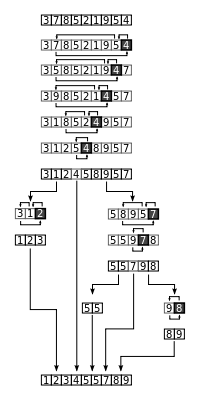
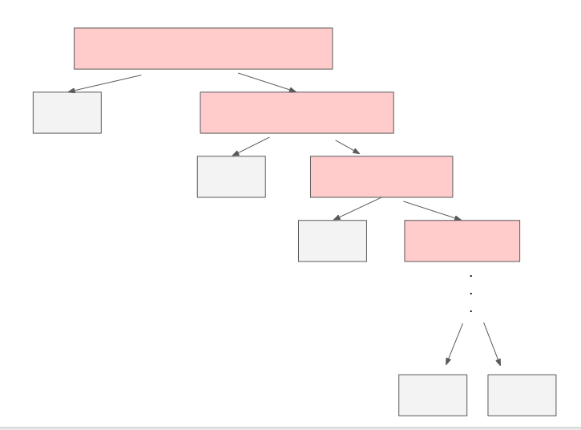

> 분할 정복 중 하나이며, 일반적으로 가장 빠른 **퀵 정렬**에 대해 알아보자


1. [퀵 정렬 과정](#퀵-정렬-과정)
2. [퀵 정렬 구현](#퀵-정렬-구현-(python))
3. [퀵 정렬 특징](#퀵-정렬의-특징)
4. [퀵 정렬 시간복잡도](#퀵-정렬의-시간복잡도)


## 퀵 정렬(quick sort) 알고리즘

- 비교 정렬이다. 다른 원소와의 비교만으로 정렬을 수행한다.
- 불안정 정렬이다. 같은 값이 있을 경우 같은 값들의 순서를 보장하지 못한다.
- 주어진 배열을 두 개로 분할하고, 각각을 정렬한다. == **분할 정복 알고리즘**
- 분할 정복(divide and conquer)
  - 문제를 작은 2개의 문제로 분리하고 각각을 해결하는 전략.
  - 일반적으로 순환 호출을 이용한다.
- 합병정렬과 달리 비균등 분할이다
  - 최악의 경우 O(n^2)의 시간복잡도를 갖는다.
  - 일반적으로 O(n long n)의 시간 복잡도를 갖는다.
- 아이디어
  - 피봇(P) 값들보다 큰 값은 오른쪽, 작은 값들은 왼쪽에 위치시켜서 피봇을 두 집합의 가운데에 위치시킨다.
  - 일반적으로, 피봇을 선택할 때 맨 왼쪽 값을 사용하나, 값의 치우침을 방지하기 위해서는 `왼쪽 끝` `오른쪽 끝` `임의의 값` 세 개 중 하나를 사용하거나, 중간값을 사용할 수도 있다.


### 퀵 정렬 과정

1. 리스트 가운데 하나의 원소를 고른다. 이렇게 고른 원소를 **피봇**이라 한다. 일반적으로 정렬되지 않은 맨 왼쪽 값을 선택한다.
2. 피봇 앞에는 피봇보다 값이 작은 모든 원소들이 오고, 피봇 뒤에는 피봇보다 값이 큰 모든 원소들이 오도록 피봇 기준으로 리스트를 둘로 **분할**한다.
3. 분할된 두 개의 작은 리스트에 대해 리스트의 크기가 0이나 1이 될 때 까지 재귀적으로 과정을 반복한다. 



위는 퀵소트의 그림이다. 피봇 4를 두고 큰 값과 작은 값을 분할하고, 분할된 리스트들을 가지고 반복한다.

<br>

<br>

### 퀵 정렬 구현 (python)

```python
def quick_sort(arr):
    if len(arr) <= 1:
        return arr

    pivot = arr[len(arr) // 2]
    # pivot = arr[0] 도 무관함. 
    low = []        # 피봇보다 작음
    high = []       # 피봇보다 큼
    equal = []      # 피봇이랑 같음. 정렬됨
    for i in arr:
        if i < pivot:
            low.append(i)
        elif i > pivot:
            high.append(i)
        else:
            equal.append(i)
    # 정렬되지 않은 low와 high를 다시 quick sort
    return quick_sort(low) + equal + quick_sort(high)

data = [3, 7, 8, 5, 2, 1, 9, 5, 4]
print(quick_sort(data))
```

위의 방법은 리스트를 매번 만들기 때문에 메모리 사용량이 크다.


### 퀵 정렬 구현 (C)

```c
#include <stdio.h>

void quick_sort(int *data, int l, int r) {
	int L = l, R = r;
	if (L > R) return;

	int mid = (L + R) / 2;
	int pivot = data[mid];

	while (L <= R) {
		while (data[L] < pivot) L++;
		while (pivot < data[R]) R--;

		if (L <= R) {
			int temp;
			temp = data[L];
			data[L] = data[R];
			data[R] = temp;
			L++;
			R--;
		}
	}
	if (L < r) quick_sort(data, L, r);
	if (l < R) quick_sort(data, l, R);
}

int main(void) {
	int data[9] = { 3, 7, 8, 5, 2, 1, 9, 5, 4 };
	int l = 0;
	int r = 9;

	quick_sort(data, 0, r-1);
	for (int i = 0; i < r; i++) {
		printf("%d ", data[i]);
	}
	return 0;
}
```

<br>

<br>

### 퀵 정렬의 특징

- 장점
  - 속도가 빠르다. 시간복잡도를 O(n log n)으로 갖는 다른 알고리즘 보다도 빠르다.
  - 추가 메모리 공간을 필요로 하지 않는다. (python처럼 코드 짰을 때 제외)
  - O(log n) 만큼의 메모리를 필요로 한다.
- 단점
  - 정렬된 리스트에 대해서는 퀵정렬의 불균형 분할에 의해 수행시간이 더 많이 걸린다.
- 단점을 극복하기 위해 피봇을 선택할 때 리스트를 균등하게 분할할 수 있는 데이터를 선택한다.
  - 랜덤값, 크기순 중간값 등

<br>

<br>

### 퀵 정렬의 시간복잡도

- 최선의 경우
  - 비교 : 각 층마다 n번
  - 순환 호출 횟수 : log n
  - T(n) = O(n log n)
- 최악의 경우
  - 
  - 비교 : 각 층마다 n번
  - 순환 호출 횟수 : n번
  - T(n) = O(n^2)
- 일반적으로 알고리즘 문제에서는 정렬되지 않은 값을 주기 때문에 평균적인 경우를 생각한다.
- T(n) = **O(n log n)**


### Ref.

[위키백과 - 퀵 정렬](https://ko.wikipedia.org/wiki/퀵_정렬)

[Heee's Development Blog](<https://gmlwjd9405.github.io/2018/05/10/algorithm-quick-sort.html>)