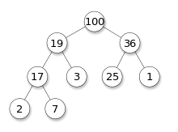

> 트리를 구성해 정렬을 하는 **힙 정렬**에 대해 알아보자


1. [힙(heap)](#힙(heap))
2. [힙 정렬 과정](#힙-정렬-과정)
3. [힙 정렬 구현](#힙-정렬-구현-(python))
4. [힙 정렬 특징](#힙-정렬의-특징)
5. [힙 정렬 시간복잡도](#힙-정렬의-시간복잡도)


## 힙 정렬(heap sort) 알고리즘

- 최대 힙 트리나 최소 힙 트리를 구성해 정렬을 하는 방법
- 내림차순 정렬 : 최대 힙, 오름차순 정렬 : 최소 힙 구성


### 힙(heap)

+ 최댓값 및 최솟값을 찾아내는 연산을 빠르게 하기 위해 고안된 자료구조.

+ 

  위 그림은 최대 힙으로 모든 부모 노드가 자식 노드보다 큰 값을 갖는다.

자료구조 '힙(heap)'에 대해서는 이후 새로운 글에서 자세히 다루겠다.


### 힙 정렬 과정

1. 주어진 원소들로 최대 힙을 구성
2. 최대 힙의 루트 노드(==현재 배열의 첫 번째 요소 == 최댓값)와 말단 노드(==현재 배열의 마지막 요소)를 교환
3. 새 루트 노드에 대해 최대 힙을 구성
4. 원소의 개수 만큼 2와 3을 반복

이 때, 주어진 자료 구조에서 힙 성질을 만족하도록 하는 연산을 **heapify**라고 한다.(3번 과정)


<br>

<br>

### 힙 정렬 구현 (python)

```python
def heapify(arr, index, heap_size):
    # 완전이진트리는 배열 하나로 트리 구현가능
    largest = index
    left = index * 2 + 1    # 왼쪽 자식
    right = index * 2 + 2   # 오른쪽 자식
    # 왼쪽 자식이 현재 요소보다 크면 인덱스 교체
    if left < heap_size and arr[left] > arr[largest]:
        largest = left
    # 오른쪽 자식이 현재 요소보다 크면 인덱스 교체
    if right < heap_size and arr[right] > arr[largest]:
        largest = right
    # 교체된적이 있다면 교체된 index와 largest 요소값 교체
    if largest != index:
        arr[largest], arr[index] = arr[index], arr[largest]
        # 변경되었으면 변경된 부분을 중심으로 다시 한번 heapify
        heapify(arr, largest, heap_size)


def heap_sort(arr):
    n = len(arr)

    # 최초 힙
    # 트리의 절반부터 거꾸로 올라가며 heapify를 하는것이 효율적
    for i in range(n // 2 - 1, -1, -1):
        heapify(arr, i, n)

    # 한번 구성된 힙을 정렬.
    # 가장 큰 값(루트) 를 가장 끝 값으로 이동한 후 힙 생성.
    for i in range(n - 1, 0, -1):
        arr[0], arr[i] = arr[i], arr[0]
        heapify(arr, 0, i)
    return arr


data = [61, 324, 21, 56, 243, 6, 1, 634, 43, 3, 52]
print(heap_sort(data))
```


### 힙 정렬 구현 (C)

```c
#include <stdio.h>

void heapify(int *arr, int index, int heap_size) {
	int largest = index;
	int left = index * 2 + 1;
	int right = index * 2 + 2;
	int temp;

	// 왼쪽 자식이 현재 요소보다 크면 인덱스 교체
	if (left < heap_size && arr[left] > arr[largest]) {
		largest = left;
	}
	// 오른쪽 자식이 현재 요소보다 크면 인덱스 교체
	if (right < heap_size && arr[right] > arr[largest]) {
		largest = right;
	}
	// 교체되었다면 index와 largest 요소값 교체
	if (largest != index) {
		temp = arr[largest];
		arr[largest] = arr[index];
		arr[index] = temp;
		// 변경 후 변경된 부분을 중심으로 다시 한 번 heapify
		heapify(arr, largest, heap_size);
	}

}
void heap_sort(int *arr, int heap_size) {
	int temp;
	// 최초 힙
	// 트리의 절반부터 거꾸로 올라가며 heapify
	for (int i = heap_size / 2; i >= 0; i--) {
		heapify(arr, i, heap_size);
	}

	// 한번 구성된 힙을 크기별로 정렬.
	// 가장 큰 값(루트)를 인덱스 맨 뒤로 보낸 뒤 힙 생성
	for (int i = heap_size - 1; i >= 0; i--) {
		temp = arr[0];
		arr[0] = arr[i];
		arr[i] = temp;
		heapify(arr, 0, i);
	}
}

int main(void) {
	int data[20] = { 61, 324, 21, 56, 243, 6, 1, 634, 43, 3, 52 };
	int n = 11;
	heap_sort(data, n);
	for (int i = 0; i < n; i++) printf("%d ", data[i]);

	return 0;
}
```

<br>

<br>

### 힙 정렬의 특징

- 장점
  - 시간 복잡도가 좋은 편
  - 힙 정렬이 가장 유용한 경우는 전체 자료를 정렬하는 것이 아니라, **가장 큰 값 몇개만 필요할 때**이다.

<br>

<br>

### 힙 정렬의 시간복잡도

- 최초 힙 생성 : O(n)
- 각 노드에 대해 heapify 수행 : 트리의 높이 * 노드의 개수 = log n * n = O(n log n)
- T(n) = O(n) + O(n log n) = **O(n log n)**


### Ref.

[위키백과 - 힙 (자료구조)](https://ko.wikipedia.org/wiki/힙_(자료_구조))

[위키백과 - 힙 정렬](https://ko.wikipedia.org/wiki/힙_정렬)

[Heee's Development Blog](<https://gmlwjd9405.github.io/2018/05/10/algorithm-heap-sort.html>)

[ratsgo's blog](https://ratsgo.github.io/data structure&algorithm/2017/09/27/heapsort/)