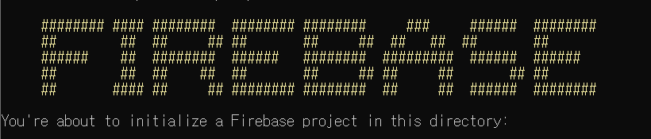

> 이번 포스트에서는 firebase를 활용한 간단한 호스팅을 목표로 한다. 여기서 사용되는 배포 페이지는 vue-cli 기반으로 만들었다.


1. [firebase 설치 및 로그인하기](#1-firebase-설치-및-로그인하기)
2. [firebase init](#2-firebase-init)
3. [vue build](#3-vue-build)
4. [firebase 배포](#4-firebase-배포)


## firebase 배포

파이어베이스에 대해서는 지난번 글([firebaseui로 로그인하기](<https://sweetlog.netlify.com/firebase/using-firebaseui/>))에서 간단하게 다루어 보았다.

이번 포스트에서는 최근 만든 빅스비 캡슐을 웹에 올려 간단하게 사용할 수 있도록 서버를 여는 것을 작성할 것이다.


### 1. firebase 설치 및 로그인하기

firebase를 init 하기 위해서는 git bash보다 기본 cmd 터미널에서 사용하는것이 좋다.(편하다)

1. firebase를 설치한다.

   ```bash
   $ npm install -g firebase-tools
   ```

2. firebase에 로그인한다.

   ```bash
   $ firebase login
   ```

   만약, 이 때 아래와 같은 오류가 난다면

   ```bash
   Error: Cannot run login in non-interactive mode. See login:ci to generate a token for use in non-interactive environments.
   ```

   interactive 모드가 아니기 때문에 아래 명령어를 통해 interactive 모드로 변환해준다.

   ```bash
   $ firebase login --interactive
   ```

   이 명령어를 입력하면 크롬창이 열리며 구글 로그인 화면이 연결된다. 구글 로그인하면 완료


### 2. firebase init


1. firebase init

   ```bash
   $ firebase init
   ```

   위 명령어를 입력하면

   

   이런 글자와 함께 바로 아랫줄에 현재 작업하고 있는 디렉토리가 나타난다.

   현재 작업하고 있는 vue-cli 폴더 등이 있어야한다.

2. 실행 및 선택과정

   ```
   ? Are you ready to proceed? (Y/n) y
   ? Are you ready to proceed? Yes
   ? Which Firebase CLI features do you want to set up for this folder? Press Space
    to select features, then Enter to confirm your choices. (Press <space> to selec
   t, <a> to toggle all, <i> to invert selection)
    ( ) Database: Deploy Firebase Realtime Database Rules
    ( ) Firestore: Deploy rules and create indexes for Firestore
    ( ) Functions: Configure and deploy Cloud Functions
    ( ) Hosting: Configure and deploy Firebase Hosti    ites
    ( ) Storage: Deploy Cloud Storage security rules
   
   ```

   과정을 진행하겠냐는 질문에 y를 입력하면 어떤 과정을 진행할것이냐고 묻는다.

   이 때, firebase의 realtime DB나 firestore를 사용하면 각각 설정해주면 되고, Storage를 사용하거나 Functions를 사용할 것이면 각각 설정해주면 된다.

   여기서 중요한 것은 **Hosting**을 선택하는 것이다. 현재 API를 활용하는 페이지이기 때문에 DB나 storage 등을 사용하지 않고 Hosting만 설정했다.

3. hosting firebase site 설정

   각자 해당하는 것을 잘 선택하면 되겠지만, firebase에서 이미 프로젝트를 생성한 뒤라면 

   ```bash
   Hosting: Configure and deploy Firebase Hosting sites
   ```

   옵션을 선택하고 내가 사용하려는 프로젝트 이름을 선택하면 된다.

4. pubilc directory 선택

   ```bash
   Your public directory is the folder (relative to your project directory) that
   will contain Hosting assets to be uploaded with firebase deploy. If you
   have a build process for your assets, use your build's output directory.
   
   ? What do you want to use as your public directory? dist
   ? Configure as a single-page app (rewrite all urls to /index.html)? No
   +  Wrote dist/404.html
   ? File dist/index.html already exists. Overwrite? No
   i  Skipping write of dist/index.html
   ```

   public directory를 **dist**로 작성. => 사용하는 정보가 npm run build 명령어를 입력한 후 dist 폴더 안에 들어갈 것이기 때문에 pubilc directory로 설정한다.

   index.html을 다시 작성할 이유가 없기 때문에 no, no를 입력.

   이후

   ```
   i  Writing configuration info to firebase.json...
   i  Writing project information to .firebaserc...
   
   +  Firebase initialization complete!
   ```

   여러 메시지들이 뜨면서 complete!


### 3. vue build

vue-cli를 사용하지 않으면 각자의 방식으로 build를 하면 된다.

1. vue 프로젝트를 build

   ```bash
   $ npm run build
   ```

   이 명령어를 입력하면 알아서 뚝딱뚝딱 하면서 build를 완료한다.


### 4. firebase 배포

```bash
$ firebase deploy
```

위에서 만들어놓은 firebase와 build 해놓은 프로젝트를 사용하여 deploy

잘 된다면 여기서도 알아서 뚝딱뚝딱 하면서 deploy.

```
Project Console: https://console.firebase.google.com/project/.../overview
Hosting URL: https://....firebaseapp.com
```

내가 만들어놓은 firebase url이 연결되며 hosting된다.


