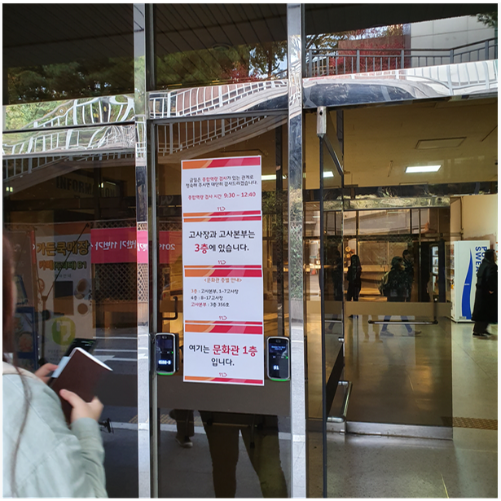
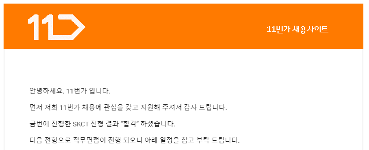

> 면접 준비를 하는데 집중이 도통 안되어 지난 3일에 본 skct 후기를 적는다. 

## 11번가 SKCT 후기

skct는 sk 계열사들이 보는 필기고사이다. 삼성은 GSAT 이 있는 것으로 알고있다.

서류에서 얼마나 떨어뜨렸는지는 모르겠지만 3층 일부와 4층 전체를 사용하고, 내가 있던 고사장에는 대략 35명 정도가 있던걸로 보아 굉장히 많은 사람들이 시험에 응시했던 것으로 기억한다.

고사장은 동국대 문화관이었고, <del>버스를 타고 길을 못찾아 조금 헤맸다... </del>

손목시계 및 다양한 전자기기는 물론, 컴퓨터용 사인펜 이외에는 필기구도 사용 금지다.

때문에 볼펜으로 푸는 연습을 하고있다가 컴퓨터용 사인펜으로 푸는 연습을 하게 되어 고생을 좀 했다. skct를 준비하시게 된다면 **꼭 컴퓨터용 사인펜으로만 푸는 연습**을 하셨으면 좋겠다.

시험은 실행역량 20분, 수학 30, 언어 20 직무 25분으로 이루어져있고, 이후 인성검사? 같은것을 꽤 길게 봤던것으로 기억한다.

 

 

 

## 어떻게 준비했나?

서비스개발 직무로 지원을 했고, 필기전형에 통과했다.

타 사 면접 준비중이라 오랜 시간을 쏟을수는 없었고, 토요일 하루를 통째로 집중했었다. 그 전 목요일과 금요일은 문제집을 풀어보는 식으로 해서 내가 얼마나 오랜 시간을 사용하는지만 체크하는 식으로 문제를 풀었다. 본인은 [위포트 문제집](<http://www.11st.co.kr/product/SellerProductDetail.tmall?method=getSellerProductDetail&prdNo=2547345304&gclid=CjwKCAiA5JnuBRA-EiwA-0ggPWVbV_hCIlQs3h5_p1DA4wqFg08DOR-gDlfry6EY9Lf4euKrRbrSfhoCH14QAvD_BwE&utm_term=&utm_campaign=%B1%B8%B1%DB%BC%EE%C7%CEPC+%C3%DF%B0%A1%C0%DB%BE%F7&utm_source=%B1%B8%B1%DB_PC_S_%BC%EE%C7%CE&utm_medium=%B0%CB%BB%F6>)을 풀었다. 하지만 실제 문제랑 다른부분이 꽤 있어서 참고용으로만 보면 될 것 같다.

skct는 실행역량과 인성검사가 높은 비중을 차지한다고 한다. 때문에 마지막 날에는 실행역량과 본인이 약한 수학부분을 주로 붙잡고있었다.

### 실행역량

유튜브를 많이 참고했는데, 첫번째로 보는 실행역량같은 경우에는 정말 많이 찾아봤던 것 같다. 문제 하나에 하나의 답이 있는것은 아니나, **최대한 맞는 답안**을 골라 가져가야하는것이 중요하다.

또한 시간이 부족한 과목중에 하나이다. 20분 동안 30문항을 풀어야하고, 이 때 신분증 검사를 같이 진행하기 때문에 진행요원께서 시간 안내를 제대로 못해주실수 있기 때문에 본인이 시간을 잘 챙기는 것이 중요하다. 

이러한 힘든 점에도 불구하고, 모든 문항을 다 체크 해야만 붙을 수 있다고 말이 나오는 만큼 중요한 과목이다.

[취업예감TV](https://youtu.be/ZnN-vZ-YSBM), [취준TV시바스키](https://youtu.be/jBi29NEnZhI), [취업끝판왕](https://youtu.be/mDscnCtDKsc)

위의 유튜브들을 많이 참고했다.

### 수리영역

이 부분은 답이 없다.

문제도 많이 풀고, 많이 노력했는데 본인도 11문제정도 풀고 3문제는 찍었다.

평소에 풀때에도 30분동안 10문제 풀고 그 중에서도 3문제는 틀리는 식이었다..... ㅋㅋㅋㅋㅋㅋ 일반적으로 skct는 틀리는 것에 대한 감점이 있기 때문에 찍지 말라고 하는데, 어차피 반도 못풀었으면 3문제 정도 찍는것은 괜찮다고 생각한다. 운 좋아서 3문제를 맞추면 15점인데, 3문제를 다 틀렸을 경우에는 약 5점 정도이니 한번쯤 걸어볼만한 도박이다. 그리고 뭐 어떤가. 45점이나 50점이나 반타작 정도인건 마찬가지인데. 그리고 만약 찍는다면 한 번호로 미는것을 추천한다. 이왕이면 확률을 높여야하니까.

본인같은 경우에는 그래도 유튜브의 [렛유인](https://youtu.be/4Zca0btq1eA)  채널 중 마하수리 목록을 많이 봤다.

<u>물론 소용은 없었다. 알려준대로 푼 것은 단 한문제도 없었다.</u>

단 한문제도.

만약 찍은게 다 맞았다면 14문제, 다 틀렸다면 반타작 50점 정도의 점수이지만 붙었다.

크게 중요하지는 않은 것 같다. 다른 부분을 잘 푼다면 말이다.

 

 

 

### 언어영역

언어는... 음...

이건 따로 준비는 안했다. 그냥 더 꼼꼼하게 읽으려고 하는 노력정도만 했다. (때문에 마지막 문제 하나를 확신 없이 찍었다.)

평소에 글을 빨리 읽고 문맥을 잘 파악하는 사람에게 유리한 분야이다. 또 운이 좋아 내가 원래 아는 지식의 지문이 나온다면 더할나위 없겠지만.

다른 곳의 인적성을 준비해본적이 없어 난이도를 비교할 수는 없지만 어려운편은 아니라고 생각한다.

  

 

### 직무영역

이 부분은 확실히 아는 문제부터 풀었다.

논리 및 추론문제는 시간은 많이 잡아먹는데 답에도 확신이 없는것들이 많아 플로우차트 문제나 코딩 문제 위주로 풀었다.

문제가 좀 쉬웠던 것 같다. 

연습할 때에는 10문제정도 풀었는데 직접 가서 풀었을 때에는 15문제정도 풀었던 것으로 기억한다.

 

 

 

### 제일 중요한 멘탈관리 영역

직무영역까지 시험이 끝나면 잠시 쉬면서 화장실을 다녀올 수 있게 시간을 준다.

이때 제일 중요한 부분이 이 시간이다.

친한 사람들끼리 왔을 경우에는 자기가 얼마나 풀었는지 얘기하고 있을수도 있고, 화장실을 갔다가 의도치 않게 다른 사람들의 이야기를 들을 수 도 있다.

본인의 경우 수리 하나, 직무 하나씩 못풀었다는 이야기를 지나가다 듣고 멘붕이 올%뻔 했다. 때문에 쉬는 시간에 같이 갔던 사람들과 이야기 하지 않고 화장실만 갔다가 자리에 앉았다. 

본인의 멘탈이 유리라면 다른 얘기 듣지 말고 자리에 앉아있는 것이 더 좋다.

이 때 핸드폰은 못본다. 그냥 멍때리고 있으면서 다음 인성검사 때 나를 어떻게 포장할지 생각하는 것이 좋다.

 

 

 

### 인성 검사

인성검사는 나를 적당히 포장하는 영역이다.

시간을 길게 주는데 한 20분 남기고 다 작성했다. 많이 고민할 필요가 없다.

중간에 하나씩 밀릴 수 있으므로 꼼꼼히 보는것이 중요하다. 고사장에서 앞앞 사람이 밀려서 수정테이프를 빌리는 것을 봤는데 찍찍 그으며 당황하는것이 느껴졌다. 조심하자.

[취업끝판왕](https://youtu.be/LwQoTt_u92Q)님의 인적성 영상을 보고 준비를 했는데, 이걸 보면서 아, 이것때문에 네이버 떨어졌나, 싶더라.<del>(면접에서 떨어졌다고 믿고 싶지 않은...)</del>

> 나는 정신이 건강하지만 인간이기 때문에 완벽하지는 않다. 그래서 법과 도덕을 90%정도 준수한다.

이 마인드를 가지고 풀라고 하시는데, 이렇게 생각하고 풀면 좋다.

 

 

 

### 결론

여기까지가 skct 후기이다. 11번가 사람들끼리 봐서 sk 본사보다는 컷트라인이 낮았을수도 있고, 아닐수도 있다.

skct는 실행역량과 인성검사가 중요하기 때문에 집중해서 준비하면 좋고, 다른 분야도 어느정도는 풀어주어야한다.

이 글이 이후에 skct를 준비하는 사람들에게 도움이 되었으면 좋겠다.

이후 면접을 보게 된다면 추가 후기글도 남겨볼 예정이다.