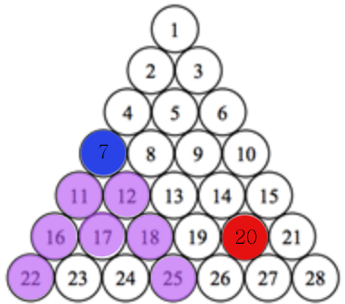
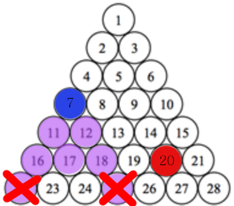

[문제](https://swexpertacademy.com/main/code/problem/problemDetail.do?contestProbId=AWJHmLraeEwDFAUH&categoryId=AWJHmLraeEwDFAUH&categoryType=CODE)<br><br>

> 규칙 찾기와 메모리 관리의 중요성


i 번째 줄에 숫자가 i 개만큼 있는 피라미드에서 특정 두 위치 a, b가 주어질 때 몇 번 만에 갈 수 있겠는가? 가 문제의 내용이다.

<br>


#### 해결 방법

1. a를 b보다 작은 수로 두자. => if (a > b) swap(a, b)
   + a에서 b까지 가는 거리와 b에서 a까지 가는 거리는 같다.
   + 아래에서 위로 올라가며 찾는 것 보다 위에서 아래로 내려가며 찾는것이 쉽다.<br>특정 위치에서 위로 올라갈 때에는 좌, 우가 모두 존재하는지 고려해야하지만, 아래로 내려갈 때에는 무조건 좌, 우가 존재하기 때문
2. 각 줄의 가장 큰 숫자를 미리 찾는다. i개씩 정렬된 i를 쉽게 찾기 위해서이다.
3. 좌, 우 각각의 숫자만 저장 후, 좌, 우 범위 내에 b가 들어오는지를 확인한다.
   + 모든 경우를 저장하거나 for를 돌리면 메모리초과, 시간초과가 날 수 있다.


### a = 2, b = 19


2에서 시작 시, 좌, 우로 이동 가능하다. 이 때 `좌 = 현재 위치 + i`, `우 = 현재 위치 + i + 1` 


cnt를 하나 증가시킨다.

좌, 우가 생성된 이후에는 `newL = L + i`, `newR = R + i + 1`로 지정 후, `newL < b < newR`인지 확인한다.


위와 같이 7과 9가 구해지면 그 사이의 8은 같은 횟수만으로 이동할 수 있다.


이와 같은 방법으로 다음줄도,


그 다음줄도 cnt가 하나씩 증가하며


19가 16과 20 사이에 포함되기 때문에 여기서 카운팅을 멈춘다.


### a = 7, b = 20


이 경우는 위에서 본것과는 조금 다르게 아래로 뻗어나가는 카운팅 횟수에서 끝나지 않는다.


이 경우에서 20은 18보다 크다. 



그러나 아랫줄에서 구한 22와 25보다는 작다. 이 범위에 들어올 수 없다.



때문에 `b가 L보다 작은지` or `b가 R보다 큰지`를 고려해 이동 방향을 결정한다.


다음과 같은 방법으로 카운팅한다.

<br>

<br>


+ python

  + 메모리 63,300 kb
  + 실행시간 323 ms

  ```python
  def find_cnt(A):
      cnt = 0
      l, r = 0, 0
      while A <= B:
          if A == B:
              if l + r == 0:
                  return b - a
              if l > b:
                  cnt += l - b
              if r < b:
                  cnt += b - r
              return cnt
  
          cnt += 1
          nl, nr = 0, 0
          if l + r == 0:
              if a + A == b or a + A + 1 == b:
                  return cnt
              nl = a + A
              nr = a + A + 1
  
          else:
              if l + A <= b and b <= r + A + 1:
                  return cnt
              nl = l + A
              nr = r + A + 1
  
          l = nl
          r = nr
          A += 1
  
  
  
  data = []
  i = 0
  num = 0
  while True:
      num += i
      data.append(num)
      i += 1
      if num > 10000:
          break
  
  
  for tc in range(int(input())):
      a, b = map(int, input().split())
      A, B = 0, 0
      result = 0
      for i in range(len(data) + 1):
          if a <= data[i] and b <= data[i]:
              A += 1
              B += 1
              break
          if a > data[i]:
              A = i
          if b > data[i]:
              B = i
  
      if a == b:
          print(f"#{tc + 1} {result}")
          continue
  
      # 무조건 a가 작게 == 아래로 내려가게
      if a > b:
          a, b = b, a
          A, B = B, A
  
      result = find_cnt(A)
  
  
      print(f"#{tc + 1} {result}")
  ```

  

- C

  - 메모리 7,300 kb
  - 실행시간 6 ms

  ```c
  #include <stdio.h>
  
  int TC;
  int data[150];
  int a, b;
  int A, B;
  int result;
  
  int find_cnt(void) {
  	int cnt = 0;
  	int l = 0;
  	int r = 0;
  
  	while (A <= B) {
  		if (A == B) {
  			if (l + r == 0) return b - a;
  			if (l > b) cnt += l - b;
  			if (r < b) cnt += b - r;
  			return cnt;
  		}
  
  		cnt++;
  		int nl = 0;
  		int nr = 0;
  
  		if (l + r == 0) {
  			if (a + A == b || a + A + 1 == b) return cnt;
  			nl = a + A;
  			nr = a + A + 1;
  		}
  		else {
  			if (l + A <= b && b <= r + A + 1) return cnt;
  			nl = l + A;
  			nr = r + A + 1;
  		}
  		l = nl;
  		r = nr;
  		A++;
  
  	}
  	return 0;
  }
  
  int main(void) {	
  	int sum = 0;
  	int plus = 0;
  	int idx = 0;
  	while (1) {
  		sum += plus;
  		data[idx++] = sum;
  		plus++;
  		if (sum > 10000) break;
  	}
  	
  	scanf("%d ", &TC);
  	for (int tc = 1; tc <= TC; tc++) {
  		scanf("%d %d ", &a, &b);
  		A = 0;
  		B = 0;
  		result = 0;
  		if (a == b) {
  			printf("#%d %d\n", tc, result);
  			continue;
  		}
  
  		if (a > b) {
  			int temp = a;
  			a = b;
  			b = temp;
  		}
  
  		for (int i = 1; i <= idx; i++) {
  			if (a <= data[i] && b <= data[i]) {
  				A++;
  				B++;
  				break;
  			}
  			if (a > data[i]) A++;
  			if (b > data[i]) B++;
  		}
  
  		result = find_cnt();
  		printf("#%d %d\n", tc, result);
  	}
  }
  ```

  <br><br><br>