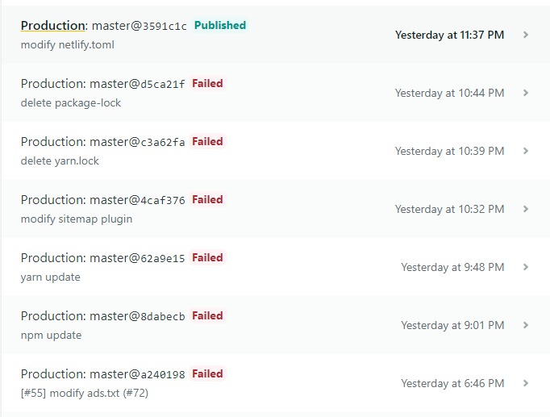

+ [발단](#발단)
+ [전개](#전개)
+ [위기](#위기)
+ [절정](#절정)
+ [결말](#결말)
+ [후일담](#후일담)


> 꾸준한 버전 업데이트의 중요성
>
> **바쁘면 결말만 보기**


### 발단

지난 달 블로그에 글을 하나도 쓰지 않아서 글을 추가하는 겸, 애드센스를 추가할 때 필요한 `ads.txt`를 추가할 겸 블로그를 켰다.

블로그에 남기지는 않았지만 루트페이지/ads.txt 안에 내용을 넣기 위해 지난번 엄청난 삽질을 했었다. 당시, 특정 주소를 만들고 그 안에 들어가는 내용을 만들기 위해서 리엑트의 사용법을 딱 당장 사용할 수 있을만큼만 익히고 페이지를 만들었었다.

그 당시만 해도 아주 과거 버전의 gatsby와 그 외의 플러그인들을 그대로 사용하고 있었다. 이미 로컬환경에서 build가 되지 않을 정도였지만 그냥 무시하고 push했고, 확인할 수 없어 밀어 넣기만 했기 때문에 그 날의 잔디는 유난히 짙어졌다.

<del>그 날의 개고생을 끝으로</del> 페이지도 생성했고 내용도 들어갔지만, 내가 생각했던것과는 달랐다. body 태그 안에 바로 달라붙어야 할 것 같은데 제대로 들어가있지도 않을 뿐더러, 결국 애드센스에서 찾지 못했는지 다시 한 번 메일을 보내줬다.

결국 그 때도 인지하고 있었지만 귀찮아서 하지 않았던, 루트 수준 도메인에 넣을 수 있는 가장 쉬운 방법인 **`static` 디렉토리에 txt 파일을 그냥 때려박는 방법**을 다시 시도했다.


### 전개

가장 먼저 억지로 만들어두었던 `/ads.txt` 주소를 지웠다. <br>`create-pages.js` 파일과 여기서 불러오도록 만든 template 파일을 삭제했다.

이후 static 폴더 안에 ads.txt 파일을 집어넣었다.

일단 여기서부터 문제가 발생했다. <u>netlify에서 배포가 실패했다.</u> 이 때의 exit code는 1. 우선 이것을 확인하기 위해 로컬 환경에서 test 서버를 build 할 수 있도록 했다.

그리고 이것은 난리 부르스의 시작이었다...

일단 없다는 것 먼저 설치를 해주기 시작했다. npm으로 설치를 하다가 뭔가 node.js 버전도 다른 것 같아 그것 먼저 설치했다. 원래 사용하고 있던 버전은 10.X 버전이었는데, 지금 나온 LTS 버전은 12.16.1버전이었다. <del>나의 게으름에 어이가 없었다.</del>

이후 미친듯한 설치와 삭제와 설치의 연속이었다.


### 위기

npm으로 설치를 다 하고 난 후 `gatsby develop` 명령어를 입력하자 조금 돌다가 멈춰버렸다. 내가 사용하고 있는 **pc의 이름에 한국어가 있어서** 실행이 되지 않았다. 후... 결국 c드라이브 아래로 폴더를 통째로 이동시켰다.

이후 사진이 썸네일 생성이 안된다며 난리난리.... 구글링을 해보니 이 문제는 큰 이미지를 사용하게 되었을 때 발생하는 문제로 sharp 모듈을 설치하면 된다고 나와있었다. 설치했고, <del>실패했다.</del> 

왜? 왜자꾸? 정말정말 어이가 없어서 sharp를 다시 설치하고 npm install 로 그냥 모듈을 모두 설치하고 난리를 치다가 **캐시를 삭제하면 된다는 것을 알았다.**

```bash
$ rm -rf node_modules/ .cache/
$ npm install
```

캐시를 삭제한 후 npm install 로 다시 설치를 하니 드디어 gatsby develop 명령어가 동작했다. localhost로 접근이 가능했고, 실행도 할 수 있었다. 

그래서 다시 netlify에 배포했다. 결과는? **실패** (대충 우는짤)

나는 다시 패닉에 빠졌고, 이런 상황에서의 방법을 또 구글링했다. 


### 절정

gatsby develop 명령어가 아닌 gatsby build 명령어를 입력해보라는 말에 입력했고, 나는 처참히 에러메세지를 받아야만 했다. 이런저런 플러그인 어쩌구가 나왔지만 마지막에 나와있는 

```bash
"gatsby-plugin-sitemap" threw an error while running the onPostBuild lifecycle:

Cannot read property 'edges' of undefined
```

에러가 발생했다. 이건 인터넷에 검색해도 같은게 잘 나오지 않았다.

```bash
  TypeError: Cannot read property 'edges' of undefined

  - gatsby-config.js:177 serialize
    C:/rain/SWEETLOG/gatsby-config.js:177:33

  - gatsby-node.js:43 _callee$
    [SWEETLOG]/[gatsby-plugin-sitemap]/gatsby-node.js:43:20

  - runMicrotasks

  - task_queues.js:97 processTicksAndRejections
    internal/process/task_queues.js:97:5

```

저 위치로 가서 177번째 줄의 edges를 지우니까 map을 지우라고 하고, 그 다음에는      `allMarkdownRemark` 까지 지우라고 하길래 그냥 한번에 싹 다 지워버렸다. 이 부분은 주소를 생성해주는 부분이었는데 아래쪽에서 굳이 건드리지 않아도 생성되어있는 부분이었기 때문에 삭제 후 로컬환경에서 실행해 문제 없이 동작하는 것을 확인했다.

그리고 결과는? **다시 한 번 실패** (엉엉 우는 짤)

이 때의 exit code는 1이었고, 몇번의 구글링 끝에 lock파일을 지우고 다시 올리라고 해서 `yarn-lock`과 `package-lock` 파일을 지우고 배포했다. 

그리고 결과는? **또 실패**

정말 미치는 시간이었다. 그래도 변화는 있었다. **exit code가 127**로 바뀌었다.


### 결말

`exit code: 127`라는 에러의 해결도 대부분은 lock 파일을 지우라는것이 대부분이었다. 하지만 나는 언제나 끈질기게 답을 해결하지. <del>한 번 시작하면 끝을 봐야하기 때문에 잘 시작 안한다</del>

결국 찾아낸 방법은 `netlify.toml` 파일의 build command를 수정해주는 것이었다.

```toml
# netlify.toml

[build]
  publish = "public"
  command = "gatsby build"		# yarn build를 gatsby build로 변경
[build.environment]
  YARN_VERSION = "1.3.2"
  YARN_FLAGS = "--no-ignore-optional"

```

기존에 yarn build가 가능하다면 아마 제대로 배포가 되었을것이라고 생각한다. <del>왜냐면 내가 yarn build 안먹혔거든...</del> 

결과적으로 build command 를 `gatsby build`로 변경해준 후 제대로 배포에 성공했다.


### 후일담

<del>진짜 나중에 추가할거임</del>



고난의 흔적...

처음에는 ads.txt만 추가하기 위해 branch를 잘 따서 사용하고 있었다.

그리고 버전 업데이트가 이렇게 더럽게 될 줄 몰랐지... 최소한 issue 하나정도는 만들고 시작할 걸 그랬다고 후회하는 중이다. 

이렇게까지 수정해놓고 ads.txt를 추가했는데 애드센스에서 반려당하면 어떻게하지... 하는 생각이 들어 마음이 무거운 밤이다.

<br><br><br>