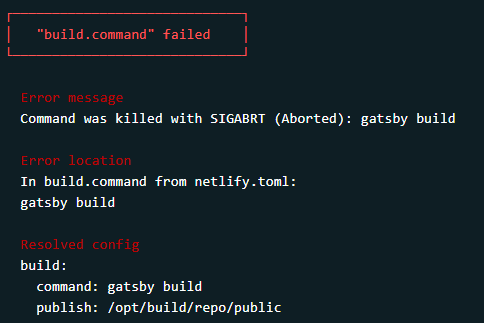
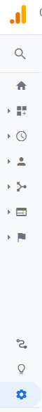
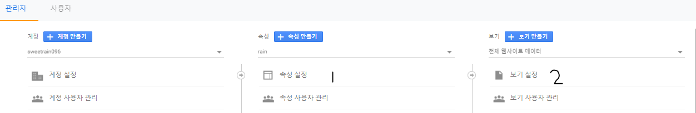
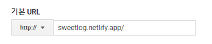
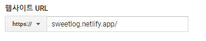
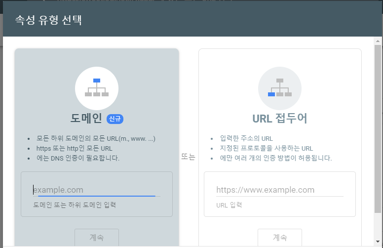
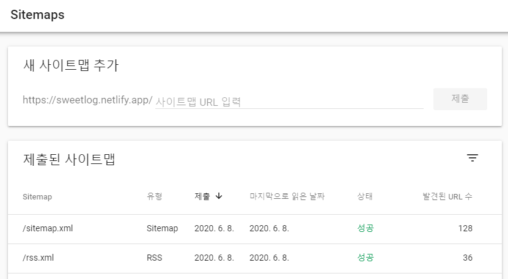

> google search console과 google analytics 변경사항을 수정해보자


+ [들어가기 전에](#들어가기-전에)
+ [netlify.toml 문제 해결](#netlifytoml-문제-해결)
+ [gatsby config 수정](#gatsby-config-수정)
+ [google analytics 수정](#google-analytics-수정)
+ [google search console 수정](#google-search-console-수정)


## 들어가기 전에

내가 오랜만에 글을 쓰기는 했지만, 뭔가 계속, 자꾸, 바뀌고있다.

지난 번 글에서 꾸준한 버전 관리를 해야한다고 해놓고... 결국 버릇을 고치지 못해...

최근에는 휴식 + 정처기 준비 중이었어서 못들어왔고, 최근에 제대로 면접준비를 하며 os나 네트워크 등 공부를 하려고 했는데 그 사이에 최상위 도메인인 `.com`이 `.app`으로 변경되었다...

당연히 서치콘솔은 물론 애널리틱스도 처참....

검색 유입이 막혔으니 당연히 유입이 떨어진 상태로 한달을 방치해뒀다...

<del>귀찮더라도 좀 찾아볼걸.... 잔디도 텅텅 비었는데...</del>


그래서 해야 할 일은 

1. gatsby config 변경
2. google analytics 수정
3. google search console 수정

순이었는데, 문제가 또 하나 발생했다. 

순서대로 해결하고 push를 했는데 변경된것으로 올라가지 않아 netlify를 확인, 그 결과

<b>에러발생</b> 두둥



Error location이라는 곳은 내가 [지난 글](https://sweetlog.netlify.app/blog/resolving_exit_code_127_in_netlify/) 에서 수정한 부분이었다...

약간의 현타와 실망과 슬픔이 공존하는 감정으로 포스팅을 시작한다.

<del>아... 운체 공부글 올리려고 했는데...</del>

<br>

<br>

<br>


## netlify.toml 문제 해결

일단 문제를 처음 직면했을 때 너무 화가났지만, <del>침착하게...</del> 구글에 검색해도 잘 해결아 안되어 조금 곤란했다.

이론상으로는 지난번과 크게 달라진게 없기 때문에 무조건 제대로 배포가 되어야 맞는 상황이었기에 더욱 당황스러웠던 것 같다.

deploy를 다시 시도해보며 캐시도 지우고 다 해봤는데, 사실 여러번의 시도를 통해 성공하기는 했다. 하지만 아직까지 정확하게 뭐를 고쳐서 됐는지는 모르겠다....


첫번째로 마지막에 고쳐서 해결 한 방법은 gatsby plugin 중 하나를 특정 버전으로 설치하는 것이다.

가장 최신 버전으로 설치한다고 해도 문제가 이상하다는 글을 참고하며 버전 업을 했다.

```bash
npm install gatsby-plugin-netlify-cms@4.1.1
```

내 경우에는 저 플러그인을 4.1.1 버전으로 설치해 주었을 때 문제가 해결되었다.

이번에 도메인이 바뀌며 netlify 전체적으로 많은 업데이트가 발생한 것 같다. 업데이트가 발생해서 도메인이 바뀌었다는 표현이 더 정확한 것 같지만, 아무튼.

그래서 이것만 올려준다고 확실히 된다는 보장을 못하겠다.

만약, 이 경우에도 문제가 발생한다면, 다음 방법도 함께 수정해보는 것이 좋을 것이다.


```
netlify.toml


[build]
  publish = "public"
  command = "gatsby build"
  base = ""
```

지난번에 수정했던 `netlify.toml`파일이다. 이 파일에서 지난번엔 publish를 수정해주었는데, base가 되는 디렉토리를 지정해주지 않아서 발생하는 경우도 종종 있다고 한다.

base 디렉토리의 주소는 `package.json`이 존재하는 디렉토리가 되어야 하며,  그것이 루트일 경우, 위와 같이 비워두면 되는 것 같다.


tmi지만, 이것을 수정하며 yarn을 다시 설치하고 삭제하고 npm과 동시에 사용해보겠다고 별 짓을 다 했었다. 결국 yarn과 npm의 문제는 아니었다.

이 때문에 yarn과 npm의 정확한 차이에 대해 알아야겠다고 생각했고, 조만간 이를 다루는 글을 가지고 오려고 한다.


## gatsby config 수정

이 부분은 가장 간단한 부분이다.

블로그의 주소가 바뀌었으니 블로그 주소를 변경해주면 된다.


루트 위치(각 프로젝트마다 다를 수 있음)의 `config.js` 파일을 수정한다.

```js
module.exports = {
  url: 'https://sweetlog.netlify.app',
    ...
}
```


## google analytics 수정

여기는 지난번에 설정이 되어있기 때문에 애널리틱스에 저장되어있는 속성과 전체 웹사이트 데이터의 보기 설정을 수정해주면 된다.


애널리틱스 접속 후 좌측 메뉴바의 맨 아래쪽 톱니바퀴를 눌러 설정창을 연다.



여기서 보게 될 부분은 1번과 2번



1번의 기본 URL과 2번의 웹사이트 URL을 각각 설정해주면 된다.




## google search console 수정

사실, 이 부분은 아직 확신이 없다. 수정해서 올려놓기는 했지만 아직 데이터 처리중이라며 며칠 후에 확인하라는 메세지를 계속 띄우기에 일단 처리한 부분까지만 올리기로 한다.


먼처 구글 서치콘솔 페이지에 접속해 로그인을 하게 되면 네비게이션 바 바로 왼쪽 하단에 내 블로그 주소가 나와있게 되는데, 이 부분을 클릭하면 `속성 추가`라는 옵션이 나온다.



도메인 또는 url 접두어를 선택하면 되는데 URL 접두어를 사용해서 등록을 했다.


등록 후 sitemap에 들어가서 사이트맵을 등록해주어야 검색이 가능한 URL 주소를 생성할 수 있다.




다음과 같이 rss와 sitemap을 각각 추가해주면 된다.

여기서 `rss.xml`로 추가하지 않고 `/rss.xml`로 추가해줘야 한다. 전자로 추가해주면 제대로 읽히지 않는다.


이 부분을 수정해주면 제대로 수정이 되어야 할텐데, 며칠 후에 결과를 수정해 변경 사항을 추가해보도록 하겠다.


