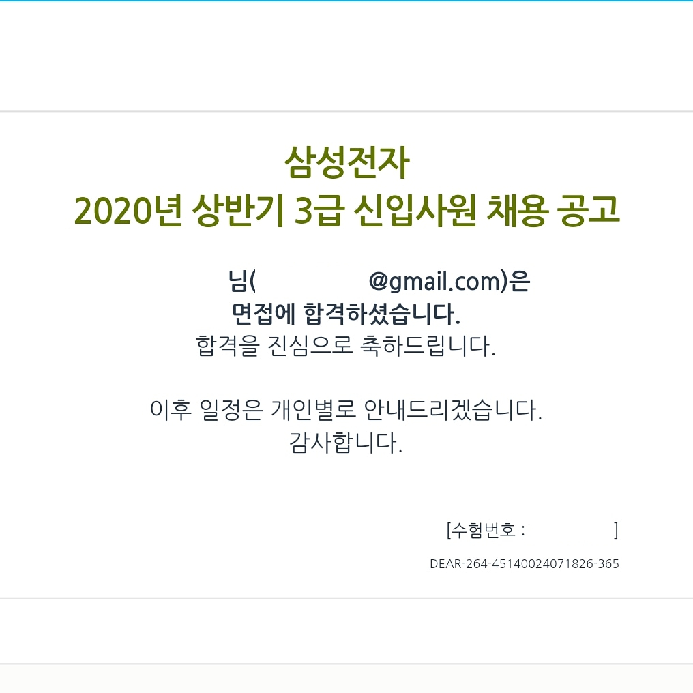

> 지난 상반기를 돌아보는 일상 글

## 2020.07

### 삼성전자

나는 결론부터 말하는 걸 잘하는 사람은 아니다. <del>하지만 면접 연습을 통해 많이 늘었지.</del>

그래서 말하자면, 나는 이번 삼성전자 s직군에 합격했다. 아직 신체결과 검사가 나오지는 않았지만... 붙었겠지... 

면접을 보기까지 많이 마음고생을 했다. 이번에 취업을 할 수 있을지에 대해 내 자신에 대한 많은 의심이 들었던게 사실이다.

작년 초에 생각했던 질문에 나는 여전히 대답을 하기 어렵기 때문이다.

> 인공지능 개발자가 하고 싶어요, 백엔드 개발자가 하고 싶어요?

그리고 6개월동안 내 고민의 답은 이렇다.

> 사람들에게 더 나은 삶을 선사하는 개발. 그런 개발자가 되고 싶어요.

동문서답인 대답일지도 모른다. 하지만, 그동안 쉬면서, 취업을 준비하면서 생각한 내 결론은 그렇다.

내 생각에, 개발자는 평생 공부하고 배워야 하는 직업이다. 그렇다면, 어떤 개발을 하는 개발자가 무엇이 중요할까. 그 행위로 어떤 결과를 만들어내는지가 중요할 뿐.

내 나름의 신념을 갖게 되니 마음이 편해졌다. 내 자신에 대해 확신이 생겼고, 부족한 지식을 채워 넣을 준비가 되었다. 나는 노력했고, 다시 한 번 나아갈 길이 생긴것이다.

나는 내 나름대로 삼성전자에서 무슨 일을 하고싶은지 명확한 생각을 가지고 있다. 물론 그 안에서 내가 하고 싶은 일을 딱 할 수 있는 것은 아니라는 것은 잘 알고있다. 그러나 그 과정이 내가 나아가는 성장 과정이 될것이라고 생각한다.

여기까지가 삼성전자에 붙은 후기 겸 감상이다. 어떻게 준비했는지에 대한 나름의 팁은 다음 글에 가져올 수 있도록 해보겠다.

   

### kbsi

나는 현재 한국기초과학지원연구원 (KBSI)에 근무하고 있다.

인턴연구원으로 입사하여 다닌지는 이제 3주가 막 되어간다. 아직까지 신분증도 나오지 않은 상황이라 신분증이 나오면 인턴으로 일하고 있는 후기를 먼저 남기려고 했던 일이 실패했다.

지원했던 직무 설명은 `생물체 분석 인공지능 앱개발`.

막상 입사를 하고 보니 내가 생각했던 일과는 꽤 많이 달라 약간의 어려움을 겪었다. 그래도 내가 할 수 있는 일부터 차근차근 진행하고 있는 중이다.

이곳에서 내가 주로 맡고 있는 일은 웹개발이다. 처음부터 구현을 해 나가는 것이 아니라 만들어진 페이지를 뜯어 고치는 작업이라 꽤 어렵다.<del>나한테만 어려울지도 모른다.</del>

웹개발은 내가 원래 선호하던 개발 분야는 아니다. 나는 웹페이지로 보이는 시각화 영역보다 시각화 되는 데이터를 만드는 프로그램을 만드는 것을 더 선호한다. 그러나 여러 박사님들과 연구원님들이 여러 연구를 통해 얻은 데이터를 DB로 쌓고, 더 많은 사람들이 이를 활용하여 다양한 연구 개발에 활용할 수 있다는 것을 알게 된 후로 재미를 붙이고 있는 중이다.

얼마 남지 않았지만, 삼전 입사일이 나올 때 까지는 쭉 다닐 계획이다.

우선, 회사생활을 조금이라도 배워갈 수 있어 좋고, 개발을 조금이라도 이어나가는 것이 감을 잃지 않아 좋다. 마지막으로 인턴이지만 꽤나 수입이 괜찮다. 식비, 교통비등의 지원이 추가로 나와 공고에 나와있는것보다 많이 받게 되어 그렇게 느끼는 것일 수도 있지만. 사실 정규직이기만 했다면 삼전과 많은 고민을 했을 것 같다.

사람들이 정말 좋고, 다양한 연구를 하는 사람들과 있어서 여러 경험을 할 수 있다. 또한 기초원 특성 상 여러개의 논문을 작성하곤 하는데, 아마 일하는 기간이 좀 더 길었다면, 내 이름이 공동저자로 끼어 들어간 논문도 한 편 나오지 않았을까 싶어서 아쉬움이 남는다.

 

  

## 2020

7월 이전의 상황을 돌이켜보면, 꽤 많은 곳에 지원을 하고 떨어졌다. 작년에 3배 이상의 이력서와 자소서를 썼고, 작년의 절반정도의 회사에 면접을 봤던 것 같다.

코로나의 영향이 꽤 컸던 것 같다. 작년보다 잘 썼다고 생각했던 자소서들이 떨어져나갈때 마다 마음이 많이 아팠다.

면접 기회들은 꾸준히 가질 수 있는건 모조리 봤다. 하지만 실제로 가고 싶다는 생각이 적었기에 모두 떨어졌다고 생각한다.

> 왜 우리 회사에 입사하고 싶어요?

이 질문에 명쾌한 대답을 할 수 있었던 회사는 결국 삼전뿐이었다.

올해 면접을 봤던 회사들 더존ICT, 신한은행, 라인 등...

이 외에 AI 면접을 본 회사들이 있지만 어쨌든 지원 동기 자체가 명확하지 않았다. 이 부분이 중요하다는 것을 새삼 알게되었다.

또한, 혼자 취업을 준비하는 시간이 매우 어렵고 고통스럽다는 것도 알았다. 코로나의 영향도 한 몫 했다. 

밖을 나갈 수 없는 상황에서 취업자리는 안열리고, 열리는 것 마다 떨어지다보니 자존감이 바닥을 쳤다. 심지어 나의 선택에 대해서도 후회와 회의감이 반복이었다.

올해 초. 20년 1월에 지원했던 회사에 대한 글이 있다. 잘 해왔었고, 하고 싶은 곳에 이력서를 제출했던 지난 1월. 나는 그 회사에 붙었다. 그리고 부모님과의 약간의 갈등 끝에 입사를 포기했었다.

<b>이후, 코로나가 터졌다.</b>

코로나로 계속 취업이 되지 못하는 동안 나는 그 날의 기억을 붙잡으며 많은 후회를 했었다.

몇 번의 반복되는 실패가, 내 자신을 한없이 바닥으로 끌고 내려갔다.

나는 그 지옥에서 벗어나기 위하여 성공 경험을 만들어주려고 노력했다.

몇 권의 책을 완독하고, 정보처리기사 시험을 준비해 필기 합격을 하고. 알고리즘 문제를 풀고, OS 강의를 완강하며 꾸준히 내가 부족한 부분을 채우고 성공하는 경험을 만들어주었다.

한없이 바닥을 치던 우울감이 조금씩 완화되었다.

  

지난 반년을 돌아보는 글이다 보니 이야기도 뒤죽박죽이고, 두서없이 이야기 하는 내용이 많았다.

이렇게 적어놓고 보니 뭔갈 많이 한 것 같기도 하고, 안 한것 같기도 하다. 엄청 많이 한다고 느낄 때도 있었고, 진짜 이렇게 잉여로 살아도 되나 생각했던 때도 있으니 얼추 맞는 것 같다.

돌아보는 글에서 까지 노력하라는 말을 하고싶지는 않지만,

지난 반 년, 많이도 노력했다.

고생했다. 나 자신.

  